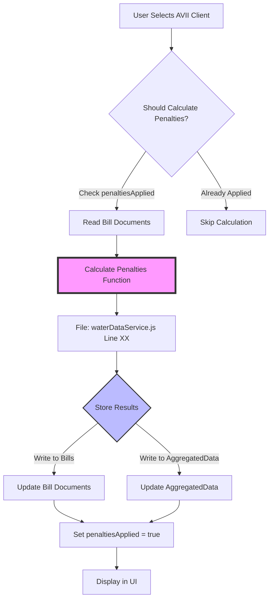

# INVESTIGATION TASK: Phase 1 - Water Bills Penalty Calculation Flow

## 🎯 MISSION: DOCUMENT, DON'T CODE

**YOU ARE AN INVESTIGATOR, NOT A DEVELOPER ON THIS TASK**

Your job is to **understand and document** how the penalty calculation system works (or doesn't work). You will produce flow diagrams, data structure maps, and gap analysis documents. **You will NOT write any code fixes.**

---

## 🔍 INVESTIGATION CONTEXT

### The Problem
After recent architectural changes (optimization + surgical updates):
- ALL units show $0 penalties (even units that never paid and are months overdue)
- All bill metadata shows `penaltiesApplied: false`
- Penalty calculation seen running in logs (but results not stored/visible)
- This is **silent failure** - no errors, just wrong data

### What We Know
- ✅ Reading entry works (bills are generated correctly)
- ✅ Bill generation works (due dates are correct)
- ✅ All penalty calculation CODE exists (worked historically)
- ❌ Recent architectural changes broke the integration
- ❌ Penalties not calculating OR not storing OR both

### Recent Architectural Changes
Review these Memory Logs to understand what changed:
1. **Water Bills Performance Optimization** (Oct 13, 2025)
   - File: `/Memory/Task_Completion_Logs/Water_Bills_Performance_Optimization_2025-10-13.md`
   - Changed: Moved to pre-calculated aggregatedData, timestamp-based cache
   - Impact: Penalties may need to be part of pre-calculation

2. **Water Bills Surgical Updates** (Oct 14, 2025)
   - File: `/Memory/Task_Completion_Logs/Water_Bills_Surgical_Implementation_COMPLETE_2025-10-14.md`
   - Changed: Unit-specific recalculation after payments
   - Impact: Surgical updates may not include penalty recalculation

---

## 📋 INVESTIGATION OBJECTIVES

### Primary Questions to Answer

#### 1. WHERE is the penalty calculation code?
- File path(s)
- Function name(s)
- Line numbers
- Helper functions called

#### 2. WHEN does penalty calculation run?
- On client selection/load?
- On specific date (bill date + grace period)?
- On manual refresh?
- On surgical update after payment?
- On full recalculation?

#### 3. WHERE are penalties stored?
- In bill documents? (Which fields?)
- In aggregatedData? (Which structure?)
- Both places?
- Is there synchronization between them?

#### 4. WHAT does `penaltiesApplied: false` mean?
- Where is this boolean set to `true`?
- Where is this boolean set to `false`?
- What code reads this value?
- Is it a trigger ("don't calculate yet") or result indicator ("calculation done")?
- Why are ALL bills showing `false`?

#### 5. HOW do architectural changes affect penalties?
- Does aggregatedData pre-calculation include penalties?
- Does surgical update recalculate penalties?
- Does timestamp-based cache skip penalty calculation?
- Are penalties calculated on-demand or pre-stored?

#### 6. WHY are penalties $0 everywhere?
- Is calculation not running at all?
- Is calculation running but not storing results?
- Is storage working but reading from wrong location?
- Is there a condition blocking calculation?

---

## 🎯 REQUIRED DELIVERABLES

### Deliverable 1: Complete Flow Diagram (Mermaid Format)
**File:** `docs/investigations/Phase_1_Penalty_Calculation_Flow_Diagram.md`

**Format:** Use Mermaid flowchart syntax for professional, visual diagrams

**Example Mermaid Structure:**


**Must Include:**
```
┌─────────────────────────────────────────────┐
│ PENALTY CALCULATION COMPLETE FLOW           │
├─────────────────────────────────────────────┤
│ 1. ENTRY POINT                              │
│    - User selects AVII client               │
│    - File: [path]                           │
│    - Function: [name] (line X)              │
│                                             │
│ 2. TRIGGER EVALUATION                       │
│    - Check: Should penalties calculate?     │
│    - Logic: [describe condition]            │
│    - Function: [name] (line X)              │
│    - Reads: penaltiesApplied boolean?       │
│                                             │
│ 3. CALCULATION EXECUTION                    │
│    - File: [path]                           │
│    - Function: [name] (line X)              │
│    - Input: [bill data, due dates, config]  │
│    - Logic: [how penalties calculated]      │
│    - Output: [penalty amounts per unit]     │
│                                             │
│ 4. STORAGE OPERATION                        │
│    - Where written: [Firestore paths]       │
│    - Fields updated: [list all fields]      │
│    - penaltiesApplied set to: true/false?   │
│                                             │
│ 5. UI INTEGRATION                           │
│    - How penalties displayed in UI          │
│    - Where UI reads penalty data            │
│    - Current behavior: Shows $0             │
│                                             │
│ 6. INTEGRATION POINTS                       │
│    - Connection to Phase 2 (Payment)        │
│    - Connection to Phase 3 (Delete)         │
└─────────────────────────────────────────────┘
```

**For EACH step, document:**
- File path
- Function name and line numbers
- What it does
- What data it reads
- What data it writes
- Expected behavior vs actual behavior

### Deliverable 2: Data Structure Map
**File:** `docs/investigations/Phase_1_Penalty_Data_Structures.md`

**Document:**

**A. Bill Document Structure**
```javascript
// Path: clients/AVII/projects/waterBills/bills/{billId}
{
  bills: {
    units: {
      "203": {
        // BEFORE penalty calculation
        currentCharge: 350,
        totalAmount: ???,
        penalties: ???,
        penaltiesApplied: false,  // WHY always false?
        
        // AFTER penalty calculation (expected)
        currentCharge: 350,
        totalAmount: 399.98,
        penalties: 49.98,
        penaltiesApplied: true,   // SHOULD be true
        
        // AFTER penalty calculation (actual)
        penalties: 0,              // WHY zero?
        penaltiesApplied: false    // WHY still false?
      }
    }
  }
}
```

**B. aggregatedData Structure**
```javascript
// Path: clients/AVII/projects/waterBills/aggregatedData/2026
{
  months: [
    {
      month: 0,  // July
      units: {
        "203": {
          // Document what penalty-related fields exist
          // Are penalties stored here?
          // How does this sync with bill documents?
        }
      }
    }
  ],
  penaltiesApplied: false,  // Is there a top-level flag?
  lastPenaltyUpdate: "2025-10-11T04:41:34.116Z"  // Static timestamp issue
}
```

**C. Synchronization Analysis**
- How do bill documents and aggregatedData stay in sync?
- Which is the "source of truth" for penalties?
- When is each one updated?

### Deliverable 3: Code Reference Document
**File:** `docs/investigations/Phase_1_Penalty_Code_Reference.md`

**Structure:**
```markdown
## Primary Penalty Calculation Functions

### Function 1: [Name]
- **File:** [path]
- **Lines:** [start-end]
- **Purpose:** [what it does]
- **Called By:** [parent functions]
- **Calls:** [child functions]
- **Reads:** [data sources]
- **Writes:** [data destinations]
- **Current Status:** [working/broken/unknown]

### Function 2: [Name]
[same structure]

## Helper Functions

### Function 3: [Name]
[same structure]

## Integration Functions

### calculateYearSummary() or equivalent
- Is this where penalties should be calculated?
- Does it currently calculate penalties?

### updateAggregatedDataAfterPayment() (surgical update)
- Does this recalculate penalties?
- Should it recalculate penalties?

## Configuration Functions

### Penalty Configuration
- Where stored: [Firestore path]
- Grace period: [days]
- Penalty rate: [percentage]
- How accessed by calculation code
```

### Deliverable 4: Gap Analysis
**File:** `docs/investigations/Phase_1_Penalty_Gap_Analysis.md`

**For EACH function in the flow:**
```markdown
## Function: [Name]

### Expected Behavior
[What SHOULD happen based on code/docs]

### Actual Behavior
[What IS happening - observed via logs/DevTools]

### Gap Identified
[Why there's a difference]

### Hypothesis
[Possible root cause]

### Evidence
[Logs, screenshots, console output]
```

### Deliverable 5: Integration Points Document
**File:** `docs/investigations/Phase_1_Integration_Points.md`

**Document:**

**A. What Phase 1 Provides to Phase 2 (Payment)**
- Penalty amounts that need to be paid
- Bill status (overdue, current, paid)
- Total amounts due per unit
- How does Phase 2 read this data?

**B. What Phase 1 Provides to Phase 3 (Delete)**
- Original penalty amounts (for reversal)
- Penalty calculation history
- How should penalties be reinstated?

**C. Shared Data Structures**
- Which fields are read by multiple phases?
- Which fields are written by multiple phases?
- Potential conflict zones

**D. Dependencies**
- Does Phase 2 depend on Phase 1 being correct?
- Does Phase 3 depend on Phase 1 or Phase 2 data?

---

## 🧪 INVESTIGATION APPROACH

### Step 1: Review Recent Architectural Changes (30 min)
Read these Memory Logs to understand what changed:
- Water Bills Performance Optimization (Oct 13)
- Water Bills Surgical Updates (Oct 14)

**Document:**
- What changed in data flow?
- What changed in calculation timing?
- What changed in storage locations?

### Step 2: Locate Penalty Calculation Code (30 min)
**Primary search targets:**
- `backend/services/waterDataService.js`
- `backend/services/waterBillsService.js`
- Search for: "penalty", "penaltiesApplied", "grace", "overdue"

**Document:**
- Every function that mentions penalties
- Call hierarchy (which functions call which)
- Where penalties are calculated vs stored

### Step 3: Trace Execution Flow (45 min)
**Use Test Harness or Chrome DevTools:**

**Option A: Test Harness**
```bash
# Navigate to SAMS directory
cd /Users/michael/Library/CloudStorage/GoogleDrive-michael@landesman.com/My\ Drive/Sandyland/SAMS

# Create test script to trace penalty calculation
# Document what happens step-by-step
```

**Option B: Chrome DevTools**
```
1. Login: michael@landesman.com / maestro
2. Select: AVII client
3. Navigate: Water Bills
4. Open: DevTools Console
5. Observe: What penalty-related logs appear?
6. Check: Network tab for API calls
7. Inspect: Firestore documents for penalty fields
```

**Document:**
- What functions execute when AVII loads?
- Are penalty calculation logs visible?
- What do bill documents look like in Firestore?
- What does aggregatedData look like?

### Step 4: Analyze penaltiesApplied Boolean (30 min)
**Search entire codebase for "penaltiesApplied":**
```bash
grep -r "penaltiesApplied" backend/ frontend/
```

**Document:**
- Every location where it's read
- Every location where it's set to true
- Every location where it's set to false
- What logic depends on this value?

### Step 5: Test Fresh AVII Data (30 min)
**Current State:**
- Fresh AVII data loaded (no corrupted test data)
- Units with overdue bills exist
- Should have penalties but show $0

**Tests to run:**
1. Check Unit 203 (or any unit with overdue bills)
2. Verify bill has past due date
3. Check if past grace period (typically due date + 10 days)
4. Expected: Should have penalties calculated
5. Actual: Check Firestore bill document - penalties field
6. Actual: Check aggregatedData - penalty fields
7. Actual: Check UI display

**Document:**
- Expected vs actual state
- Where is the breakdown?

---

## 🎯 SUCCESS CRITERIA

### Investigation Complete When:
- ✅ All 5 deliverable documents created
- ✅ Complete flow diagram shows every step with file/line references
- ✅ `penaltiesApplied` boolean purpose clearly understood
- ✅ Gap between expected and actual behavior identified with evidence
- ✅ Integration points with Phase 2 and 3 documented
- ✅ Hypothesis for root cause proposed (even if not proven)

### DO NOT:
- ❌ Write any code fixes
- ❌ Modify any files
- ❌ Make assumptions without evidence
- ❌ Skip documentation steps

### DO:
- ✅ Use console.log statements to trace execution (read-only debugging)
- ✅ Take screenshots of Firestore documents
- ✅ Capture console logs
- ✅ Document every observation
- ✅ Ask Manager Agent if uncertain about anything

---

## 🔧 TESTING TOOLS AVAILABLE

### Tool 1: Test Harness
- Location: `backend/testing/`
- Can create scripts to test specific functions
- Can observe function outputs without modifying code

### Tool 2: Chrome DevTools MCP
- Can login and navigate UI
- Can inspect console logs
- Can view network requests
- Can examine Firestore documents

### Tool 3: Manual Testing with Michael
If you need specific tests run with log monitoring:
1. Stop your investigation
2. Document what you need tested
3. Ask Michael to restart servers with log monitoring
4. He'll report back findings

### Fresh Data Reset
If you contaminate data significantly:
- Request fresh AVII data reload (5 minutes)
- Document why reset needed

---

## 📊 EXPECTED TIMELINE

- **Review architecture changes:** 30 min
- **Locate penalty code:** 30 min
- **Trace execution flow:** 45 min
- **Analyze penaltiesApplied:** 30 min
- **Test fresh AVII data:** 30 min
- **Create documentation:** 60 min

**Total: 2.5-3 hours**

---

## 🚨 CRITICAL REMINDERS

### This is Part of 3-Phase Investigation
- **Phase 1 (You):** Penalty Calculation
- **Phase 2 (Other Agent):** Payment Cascade
- **Phase 3 (Other Agent):** Delete Reversal

**After all 3 phases complete:**
- Manager Agent will synthesize findings
- Compare integration points across phases
- Identify conflicts and dependencies
- Create coordinated fix strategy

### Your Integration Responsibilities
Document how Phase 1 connects to Phases 2 and 3:
- What data does Phase 2 need from Phase 1?
- What data does Phase 3 need from Phase 1?
- Where are potential conflicts?

### No Code Changes Yet
**We need the complete picture before changing anything.** Your documentation will enable:
1. Understanding the full system
2. Planning coordinated fixes that don't break each other
3. Applying lessons to HOA Dues next

---

## 📝 MEMORY LOG REQUIREMENTS

### Memory Log Path
`apm_session/Memory/Task_Completion_Logs/Investigation_Phase_1_Penalty_Calculation_2025-10-15.md`

### Memory Log Must Include
- Summary of investigation findings
- References to all 5 deliverable documents created
- Key discoveries (what's broken and why)
- Integration points documented
- Hypothesis for root cause
- Recommendations for Manager Agent review

---

## ✅ COMPLETION CHECKLIST

- [ ] Read recent architectural change Memory Logs
- [ ] Located all penalty calculation code
- [ ] Traced execution flow with evidence
- [ ] Analyzed penaltiesApplied boolean usage
- [ ] Tested with fresh AVII data
- [ ] Created Deliverable 1: Flow Diagram
- [ ] Created Deliverable 2: Data Structure Map
- [ ] Created Deliverable 3: Code Reference
- [ ] Created Deliverable 4: Gap Analysis
- [ ] Created Deliverable 5: Integration Points
- [ ] Created Memory Log with findings
- [ ] NO CODE CHANGES MADE

---

**Task Type:** Investigation (Documentation Only)  
**Parallel Execution:** Yes (with Phases 2 and 3)  
**Code Changes:** NONE - Investigation Only  
**Estimated Duration:** 2-3 hours  
**Deliverables:** 5 documentation files + Memory Log

**Manager Agent Sign-off:** October 15, 2025  
**Status:** Ready for Assignment to Implementation Agent (Fresh Eyes)  
**Next Step:** Synthesis after all 3 phases complete

