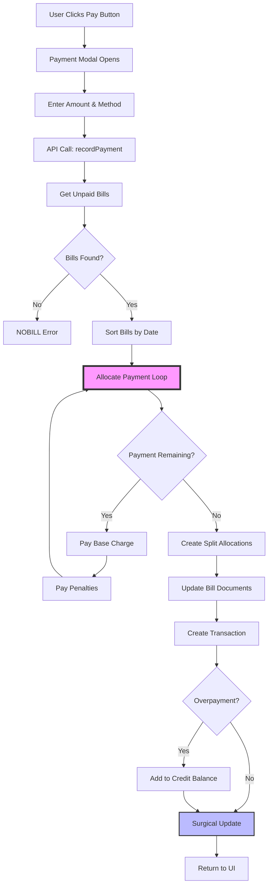

# INVESTIGATION TASK: Phase 2 - Water Bills Payment Cascade Flow

## 🎯 MISSION: DOCUMENT, DON'T CODE

**YOU ARE AN INVESTIGATOR, NOT A DEVELOPER ON THIS TASK**

Your job is to **understand and document** how the payment cascade system works (or doesn't work). You will produce flow diagrams, data structure maps, and gap analysis documents. **You will NOT write any code fixes.**

---

## 🔍 INVESTIGATION CONTEXT

### The Problem
After recent architectural changes (optimization + surgical updates):
- Credit balance not updating until page reload
- Paid bill amounts not cleared from display
- Due amounts incorrect after refresh/recalc
- "NOBILL" error blocking overdue payments (no current usage)

### What We Know
- ✅ Payment modal opens and accepts input
- ✅ Transaction created successfully
- ✅ Split allocations created (Priority 1 work)
- ❌ Bill status updates not working correctly
- ❌ Credit balance integration broken
- ❌ Display logic showing wrong amounts

### Payment Cascade Logic (Expected)
Payment amount should cascade through bills in this order:
1. **Oldest bill base charge** (current charge)
2. **Oldest bill penalties**
3. **Next bill base charge**
4. **Next bill penalties**
5. Continue until payment exhausted or all bills paid
6. **Overpayment** → Credit balance in HOA Dues
7. **Underpayment** → Partial payment marked, remaining due tracked

### Recent Architectural Changes
Review these Memory Logs to understand what changed:
1. **Water Bills Split Transactions** (Oct 14, 2025)
   - File: `/Memory/Task_Completion_Logs/Priority_1_Water_Bills_Split_Transactions_2025-10-14.md`
   - Changed: Payments now create allocations[] array
   - Impact: Payment data structure different

2. **Water Bills Surgical Updates** (Oct 14, 2025)
   - File: `/Memory/Task_Completion_Logs/Water_Bills_Surgical_Implementation_COMPLETE_2025-10-14.md`
   - Changed: Unit-specific recalculation after payments
   - Impact: Should trigger immediately after payment

---

## 📋 INVESTIGATION OBJECTIVES

### Primary Questions to Answer

#### 1. WHERE is the payment cascade code?
- File path(s)
- Function name(s)
- Line numbers
- Helper functions called

#### 2. HOW does payment allocation work?
- How does it determine which bills to pay first?
- How does it split payment across base charges and penalties?
- How does it handle partial payments?
- How does it track remaining due amounts?

#### 3. WHERE are payment results stored?
- Bill documents updated? (Which fields?)
- aggregatedData updated? (Which structure?)
- Transaction document created?
- Credit balance in HOA Dues?

#### 4. WHEN does surgical update trigger?
- Is updateAggregatedDataAfterPayment() called after payment?
- Does it recalculate just the paid unit?
- Does it update bill status correctly?
- Does it clear due amounts?

#### 5. HOW does credit balance integration work?
- Where is credit balance code?
- When is HOA Dues document updated?
- Why doesn't it update until reload?
- What should trigger immediate update?

#### 6. WHAT is the "NOBILL" error logic?
- Where is this error generated?
- What condition triggers it?
- Why does it block overdue payments without current usage?
- Should overdue bills be payable without current usage?

---

## 🎯 REQUIRED DELIVERABLES

### Deliverable 1: Complete Flow Diagram (Mermaid Format)
**File:** `docs/investigations/Phase_2_Payment_Cascade_Flow_Diagram.md`

**Format:** Use Mermaid flowchart syntax for professional, visual diagrams

**Example Mermaid Structure:**


**Must Include:**
```
┌─────────────────────────────────────────────┐
│ PAYMENT CASCADE COMPLETE FLOW               │
├─────────────────────────────────────────────┤
│ 1. ENTRY POINT                              │
│    - User clicks "Pay" on unit              │
│    - File: [component path]                 │
│    - Function: [name] (line X)              │
│                                             │
│ 2. PAYMENT DATA COLLECTION                  │
│    - Amount entered                         │
│    - Payment method selected                │
│    - Use credit balance checkbox?           │
│    - API call: [endpoint]                   │
│                                             │
│ 3. BACKEND PAYMENT PROCESSING               │
│    - File: [path]                           │
│    - Controller: [name]                     │
│    - Service: [name]                        │
│    - Function: recordPayment() or similar   │
│                                             │
│ 4. BILL RETRIEVAL                           │
│    - How are unpaid bills found?            │
│    - What order are they processed?         │
│    - "NOBILL" error logic here?             │
│                                             │
│ 5. PAYMENT ALLOCATION LOGIC                 │
│    - Loop through bills (oldest first)      │
│    - Apply to base charge first             │
│    - Then to penalties                      │
│    - Track remaining payment amount         │
│    - Handle partial payments                │
│                                             │
│ 6. SPLIT ALLOCATIONS CREATION               │
│    - createWaterBillsAllocations()          │
│    - How allocations array built            │
│    - Connection to split transactions       │
│                                             │
│ 7. BILL DOCUMENT UPDATES                    │
│    - Which fields updated?                  │
│    - paidAmount, basePaid, penaltyPaid?     │
│    - status changed to "paid"?              │
│    - payments[] array appended?             │
│                                             │
│ 8. TRANSACTION CREATION                     │
│    - transactionsController.js              │
│    - Transaction document created           │
│    - allocations[] included                 │
│                                             │
│ 9. CREDIT BALANCE INTEGRATION               │
│    - If overpayment: Add to HOA Dues        │
│    - If using credit: Deduct from HOA Dues  │
│    - File: [where is this code?]            │
│    - Function: [name]                       │
│    - When executed: Before/after commit?    │
│                                             │
│ 10. SURGICAL UPDATE TRIGGER                 │
│     - updateAggregatedDataAfterPayment()    │
│     - When called: Immediately after?       │
│     - What it updates: aggregatedData       │
│     - Should clear due amounts              │
│                                             │
│ 11. RESPONSE TO FRONTEND                    │
│     - What data returned?                   │
│     - Success indicators                    │
│     - Updated bill data?                    │
│                                             │
│ 12. UI REFRESH                              │
│     - How does UI update?                   │
│     - Cache cleared?                        │
│     - Manual refresh needed?                │
│     - Why aren't amounts cleared?           │
│                                             │
│ 13. INTEGRATION POINTS                      │
│     - Connection to Phase 1 (Penalties)     │
│     - Connection to Phase 3 (Delete)        │
└─────────────────────────────────────────────┘
```

**For EACH step, document:**
- File path
- Function name and line numbers
- What it does
- What data it reads
- What data it writes
- Expected behavior vs actual behavior

### Deliverable 2: Payment Allocation Logic Map
**File:** `docs/investigations/Phase_2_Payment_Allocation_Logic.md`

**Document the cascade algorithm:**
```javascript
// Pseudo-code for how payment SHOULD cascade
function allocatePayment(paymentAmount, unpaidBills) {
  let remaining = paymentAmount;
  let allocations = [];
  
  // Sort bills by date (oldest first)
  bills.sort(by date);
  
  // For each bill (oldest to newest)
  for (bill of bills) {
    if (remaining <= 0) break;
    
    // Step 1: Pay base charge first
    const baseDue = bill.currentCharge - bill.basePaid;
    const basePayment = Math.min(remaining, baseDue);
    if (basePayment > 0) {
      allocations.push({
        billId: bill.id,
        type: "base",
        amount: basePayment
      });
      remaining -= basePayment;
    }
    
    // Step 2: Pay penalties second
    const penaltiesDue = bill.penalties - bill.penaltyPaid;
    const penaltyPayment = Math.min(remaining, penaltiesDue);
    if (penaltyPayment > 0) {
      allocations.push({
        billId: bill.id,
        type: "penalty",
        amount: penaltyPayment
      });
      remaining -= penaltyPayment;
    }
  }
  
  // Step 3: Handle overpayment
  if (remaining > 0) {
    allocations.push({
      type: "credit",
      amount: remaining
    });
  }
  
  return allocations;
}
```

**Then document:**
- Where is this logic in actual code?
- Does it match expected algorithm?
- Where are the gaps?

### Deliverable 3: Data Structure Map
**File:** `docs/investigations/Phase_2_Payment_Data_Structures.md`

**Document:**

**A. Bill Document Updates**
```javascript
// Path: clients/AVII/projects/waterBills/bills/{billId}
// Unit 203 June bill example

// BEFORE payment
{
  bills: {
    units: {
      "203": {
        currentCharge: 350,
        penalties: 49.98,
        totalAmount: 399.98,
        paidAmount: 0,
        basePaid: 0,
        penaltyPaid: 0,
        status: "unpaid",
        payments: []
      }
    }
  }
}

// AFTER payment of $399.98 (EXPECTED)
{
  bills: {
    units: {
      "203": {
        currentCharge: 350,
        penalties: 49.98,
        totalAmount: 399.98,
        paidAmount: 399.98,      // SHOULD update
        basePaid: 350,            // SHOULD update
        penaltyPaid: 49.98,       // SHOULD update
        status: "paid",           // SHOULD change
        payments: [{              // SHOULD append
          amount: 399.98,
          transactionId: "...",
          date: "...",
          method: "..."
        }]
      }
    }
  }
}

// AFTER payment (ACTUAL - document what you observe)
{
  // What actually happens?
  // Are fields updated?
  // Which ones? Which aren't?
}
```

**B. Transaction Document Structure**
```javascript
// Path: clients/AVII/transactions/{transactionId}
{
  transactionId: "2025-10-15_...",
  amount: 39998,  // cents
  category: "-split-",
  allocations: [
    {
      id: 0,
      type: "Water Bills",
      targetName: "Unit 203",
      amount: 35000,  // base charge in cents
      categoryName: "Water Charges",
      categoryId: "water-charges",
      data: {
        unitId: "203",
        billId: "2026-00",
        paymentType: "base"
      }
    },
    {
      id: 1,
      type: "Water Bills",
      targetName: "Unit 203",
      amount: 4998,  // penalty in cents
      categoryName: "Water Penalties",
      categoryId: "water-penalties",
      data: {
        unitId: "203",
        billId: "2026-00",
        paymentType: "penalty"
      }
    }
  ]
}
```

**C. HOA Dues Credit Balance Integration**
```javascript
// Path: clients/AVII/hoaDues/units/{unitId}
{
  creditBalance: 50000,  // $500 in cents
  creditHistory: [
    {
      amount: -10000,  // -$100 (used for water bills)
      date: "...",
      transactionId: "...",
      note: "Water Bills Payment - Unit 203"  // Expected
      // Actual: Shows "MANUAL ADJUSTMENT" and "[object Object]"
    }
  ]
}
```

**D. aggregatedData Updates**
```javascript
// Path: clients/AVII/projects/waterBills/aggregatedData/2026
{
  months: [
    {
      month: 0,  // July
      units: {
        "203": {
          // Document what changes here after payment
          // Does status update?
          // Do amounts clear?
          // Does surgical update work?
        }
      }
    }
  ]
}
```

### Deliverable 4: Code Reference Document
**File:** `docs/investigations/Phase_2_Payment_Code_Reference.md`

**Structure:**
```markdown
## Primary Payment Functions

### recordPayment() or equivalent
- **File:** backend/services/waterPaymentsService.js
- **Lines:** [start-end]
- **Purpose:** Main payment entry point
- **Flow:** [step by step]
- **Calls:** [other functions]

### _getUnpaidBillsForUnit() or equivalent
- **File:** [path]
- **Lines:** [start-end]
- **Purpose:** Retrieve bills to pay
- **Logic:** [how it finds unpaid bills]
- **"NOBILL" error:** [where generated?]

### createWaterBillsAllocations()
- **File:** backend/services/waterPaymentsService.js
- **Lines:** [from Priority 1 work]
- **Purpose:** Create split allocations
- **Integration:** How does this work with cascade?

### updateAggregatedDataAfterPayment()
- **File:** backend/services/waterDataService.js
- **Lines:** [from surgical update work]
- **Purpose:** Surgical recalc after payment
- **Question:** Is this actually being called?

### Credit Balance Functions
- **File:** [where is HOA Dues integration?]
- **Functions:** [list all credit-related functions]
- **When called:** [in payment flow]

## Integration Points

### Transaction Controller
- **File:** backend/controllers/transactionsController.js
- **Function:** createTransaction()
- **How payment data flows here**

### Frontend Components
- **Payment Modal:** [component name and path]
- **How it calls backend**
- **How it refreshes UI**
```

### Deliverable 5: Gap Analysis
**File:** `docs/investigations/Phase_2_Payment_Gap_Analysis.md`

**Document each observed issue:**

```markdown
## Issue 1: Credit Balance Not Updating Until Reload

### Expected Behavior
1. User pays water bill using $100 credit
2. HOA Dues credit immediately updates to $400
3. No reload required

### Actual Behavior
1. Payment succeeds
2. HOA Dues still shows $500
3. Reload → now shows $400

### Gap Analysis
- **Where is credit update code?** [file/function]
- **When is it called?** [timing in flow]
- **Why doesn't UI update?** [cache? missing trigger?]
- **What should trigger immediate update?** [hypothesis]

### Evidence
[Console logs, screenshots, Firestore snapshots]

---

## Issue 2: Paid Bill Amounts Not Cleared

### Expected Behavior
After payment:
- Bill status: "Paid"
- Due amount: $0
- Display: Cleared or removed from view

### Actual Behavior
After payment:
- Bill status: "Paid" ✓
- Due amount: Still shows original amount ✗
- Display: Looks like still owed ✗

### Gap Analysis
[Same structure as Issue 1]

---

## Issue 3: Due Amount Shows After Refresh/Recalc

### Expected Behavior
After payment + full refresh + reload:
- Due amount should be $0 for paid bills

### Actual Behavior
Still shows due amount even after:
- Payment
- Full refresh (10s recalc)
- Browser reload

### Gap Analysis
[Same structure as Issue 1]

---

## Issue 4: "NOBILL" Error Blocks Overdue Payments

### Expected Behavior
Unit with overdue bills but no current usage:
- Can open payment modal
- Can pay overdue amounts
- "NOBILL" only if NO bills exist

### Actual Behavior
- Shows "NOBILL" error
- Payment modal won't open
- Cannot collect overdue payments

### Gap Analysis
[Same structure as Issue 1]
```

### Deliverable 6: Integration Points Document
**File:** `docs/investigations/Phase_2_Integration_Points.md`

**Document:**

**A. What Phase 2 Needs from Phase 1 (Penalties)**
- Penalty amounts to include in payment allocation
- Total due amount per bill (base + penalties)
- Bill status (overdue, current, paid)
- How does payment code read this data?

**B. What Phase 2 Provides to Phase 3 (Delete)**
- Payment allocation structure (to reverse)
- Bill document updates (to undo)
- Credit balance changes (to reverse)
- Transaction structure (to delete)

**C. Shared Data Structures**
- Bill documents (read by all 3 phases)
- aggregatedData (read/write by all 3 phases)
- HOA Dues credit balance (Phase 2 writes, Phase 3 reverses)
- Transaction allocations (Phase 2 creates, Phase 3 reads)

**D. Surgical Update Integration**
- Should surgical update trigger after payment?
- Should surgical update trigger after delete?
- Is it currently integrated in payment flow?
- Does it update the right data structures?

---

## 🧪 INVESTIGATION APPROACH

### Step 1: Review Recent Architectural Changes (30 min)
Read these Memory Logs:
- Water Bills Split Transactions (Oct 14)
- Water Bills Surgical Updates (Oct 14)

**Document:**
- How split allocations integrated into payment flow?
- How surgical update integrated into payment flow?
- What changed in data structures?

### Step 2: Locate Payment Code (30 min)
**Primary search targets:**
- `backend/services/waterPaymentsService.js`
- `backend/controllers/transactionsController.js`
- Search for: "recordPayment", "allocate", "cascade", "NOBILL"

**Document:**
- Payment entry function
- Allocation logic function
- Bill update functions
- Credit balance functions

### Step 3: Trace Payment Flow (60 min)
**Use Chrome DevTools:**
```
1. Login: michael@landesman.com / maestro
2. Select: AVII client
3. Navigate: Water Bills
4. Find unit with unpaid bills (e.g., Unit 203)
5. Click: "Pay" or "UNPAID" button
6. Enter: Payment amount
7. Open: DevTools Console (before submitting)
8. Submit: Payment
9. Observe: Console logs
10. Check: Network tab (API calls)
11. Inspect: Firestore documents after payment
```

**Document:**
- What API endpoint called?
- What response received?
- What console logs appeared?
- What changed in Firestore?
- What DIDN'T change?

### Step 4: Test Each Issue (60 min)

**Test Issue 1: Credit Balance**
1. Note starting credit balance in HOA Dues
2. Make water bill payment using credit
3. Check HOA Dues credit (before reload)
4. Expected: Updated immediately
5. Actual: Document what happens
6. Reload page
7. Check again: Document result

**Test Issue 2: Bill Amounts**
1. Note bill Due amount before payment
2. Make payment
3. Check: Status changed to "Paid"?
4. Check: Due amount cleared?
5. Expected vs Actual: Document

**Test Issue 3: Refresh Behavior**
1. Make payment on a unit
2. Click Refresh button (full recalc)
3. Wait 10 seconds for completion
4. Reload browser page
5. Check: Due amounts correct?
6. Expected vs Actual: Document

**Test Issue 4: "NOBILL" Error**
1. Find unit with overdue bills but no current usage
   - Suggested: Units 202 or 204
2. Try to make payment
3. Expected: Payment modal opens
4. Actual: "NOBILL" error?
5. Document: Where is error coming from?

---

## 🎯 SUCCESS CRITERIA

### Investigation Complete When:
- ✅ All 6 deliverable documents created
- ✅ Complete flow diagram shows every step with file/line references
- ✅ Payment allocation logic documented and analyzed
- ✅ All 4 payment issues documented with gap analysis
- ✅ Integration points with Phase 1 and 3 documented
- ✅ Hypothesis for each issue proposed (even if not proven)

### DO NOT:
- ❌ Write any code fixes
- ❌ Modify any files
- ❌ Make assumptions without evidence
- ❌ Skip testing steps

### DO:
- ✅ Use console.log statements to trace execution (read-only debugging)
- ✅ Take screenshots of UI behavior
- ✅ Capture console logs
- ✅ Document every observation
- ✅ Test with real payments (fresh data can be reloaded)

---

## 🔧 TESTING TOOLS AVAILABLE

### Tool 1: Chrome DevTools MCP
- Login and navigate UI
- Make test payments
- Inspect console logs
- View network requests
- Examine Firestore documents
- Fresh data available (can reload if needed)

### Tool 2: Test Harness
- Location: `backend/testing/`
- Can create scripts to test payment functions
- Can isolate specific logic

### Tool 3: Manual Testing with Michael
If you need specific tests with log monitoring:
1. Document what you need tested
2. Ask Michael to restart servers with log monitoring
3. He'll report back findings

---

## 📊 EXPECTED TIMELINE

- **Review architecture changes:** 30 min
- **Locate payment code:** 30 min
- **Trace payment flow:** 60 min
- **Test 4 issues:** 60 min
- **Create documentation:** 60 min

**Total: 3-3.5 hours**

---

## 🚨 CRITICAL REMINDERS

### This is Part of 3-Phase Investigation
- **Phase 1 (Other Agent):** Penalty Calculation
- **Phase 2 (You):** Payment Cascade
- **Phase 3 (Other Agent):** Delete Reversal

**After all 3 phases complete:**
- Manager Agent will synthesize findings
- Compare integration points across phases
- Identify conflicts and dependencies
- Create coordinated fix strategy

### Your Integration Responsibilities
Document how Phase 2 connects to Phases 1 and 3:
- What data does Phase 2 need from Phase 1?
- What data does Phase 3 need to reverse from Phase 2?
- Where are potential conflicts?

---

## 📝 MEMORY LOG REQUIREMENTS

### Memory Log Path
`apm_session/Memory/Task_Completion_Logs/Investigation_Phase_2_Payment_Cascade_2025-10-15.md`

### Memory Log Must Include
- Summary of investigation findings
- References to all 6 deliverable documents created
- Key discoveries about payment flow
- All 4 issues documented with evidence
- Integration points documented
- Recommendations for Manager Agent review

---

## ✅ COMPLETION CHECKLIST

- [ ] Read recent architectural change Memory Logs
- [ ] Located all payment cascade code
- [ ] Traced complete payment flow with evidence
- [ ] Tested Issue 1: Credit balance update
- [ ] Tested Issue 2: Bill amounts not cleared
- [ ] Tested Issue 3: Due amount after refresh
- [ ] Tested Issue 4: "NOBILL" error
- [ ] Created Deliverable 1: Flow Diagram
- [ ] Created Deliverable 2: Allocation Logic Map
- [ ] Created Deliverable 3: Data Structure Map
- [ ] Created Deliverable 4: Code Reference
- [ ] Created Deliverable 5: Gap Analysis (all 4 issues)
- [ ] Created Deliverable 6: Integration Points
- [ ] Created Memory Log with findings
- [ ] NO CODE CHANGES MADE

---

**Task Type:** Investigation (Documentation Only)  
**Parallel Execution:** Yes (with Phases 1 and 3)  
**Code Changes:** NONE - Investigation Only  
**Estimated Duration:** 2.5-3.5 hours  
**Deliverables:** 6 documentation files + Memory Log

**Manager Agent Sign-off:** October 15, 2025  
**Status:** Ready for Assignment to Implementation Agent (Fresh Eyes)  
**Next Step:** Synthesis after all 3 phases complete

