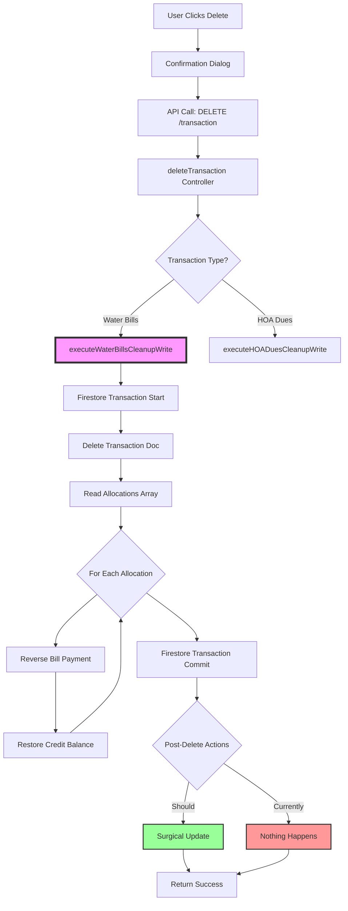

# INVESTIGATION TASK: Phase 3 - Water Bills Delete/CRUD Reversal Flow

## 🎯 MISSION: DOCUMENT, DON'T CODE

**YOU ARE AN INVESTIGATOR, NOT A DEVELOPER ON THIS TASK**

Your job is to **understand and document** how the transaction deletion/reversal system works (or doesn't work). You will produce flow diagrams, data structure maps, and gap analysis documents. **You will NOT write any code fixes.**

---

## 🔍 INVESTIGATION CONTEXT

### The Problem
After recent architectural changes, transaction deletion (CRUD reversal) is broken:
- Delete transaction doesn't restore credit balance
- Delete transaction doesn't mark bills unpaid (even after refresh)
- `lastPenaltyUpdate` field not updating (suggests surgical recalc not triggering)

### What We Know
- ✅ Delete transaction API call succeeds (no errors)
- ✅ Transaction document gets deleted from Firestore
- ❌ Bill documents not updated (remain "paid")
- ❌ Credit balance not restored
- ❌ Penalties not reinstated
- ❌ Full refresh (recalc) doesn't fix the state

### Expected CRUD Reversal Behavior
When deleting a Water Bills payment transaction:
1. **Transaction deleted** from Firestore
2. **Bills marked unpaid** (status changed)
3. **Payment amounts cleared** (paidAmount, basePaid, penaltyPaid reset)
4. **Credit balance restored** (if credit was used)
5. **Credit balance removed** (if overpayment created credit)
6. **Penalties reinstated** (if penalties were paid)
7. **aggregatedData recalculated** (surgical update or full recalc)

### Recent Architectural Changes
Review these Memory Logs to understand what changed:
1. **Water Bills Surgical Updates** (Oct 14, 2025)
   - File: `/Memory/Task_Completion_Logs/Water_Bills_Surgical_Implementation_COMPLETE_2025-10-14.md`
   - Changed: Unit-specific recalculation after payments
   - Impact: Should surgical update trigger after delete too?

2. **HOA Dues Cascade Delete** (Working Reference)
   - File: `backend/controllers/transactionsController.js`
   - Function: `executeHOADuesCleanupWrite()` (lines 1003-1177)
   - This WORKS correctly - use as reference pattern

---

## 📋 INVESTIGATION OBJECTIVES

### Primary Questions to Answer

#### 1. WHERE is the delete/reversal code?
- File: `backend/controllers/transactionsController.js`
- Function: `executeWaterBillsCleanupWrite()` (lines 1180-1277)
- Helper functions called
- Firestore transaction scope

#### 2. WHAT does executeWaterBillsCleanupWrite() actually do?
- What fields does it update in bill documents?
- Does it restore credit balance?
- Does it clear payment arrays?
- Does it trigger surgical recalc?

#### 3. HOW should bill documents be reversed?
- Which fields need to be reset?
- paidAmount, basePaid, penaltyPaid → 0?
- status → "unpaid"?
- payments[] array → remove entry or clear?
- penalties → reinstated or recalculated?

#### 4. HOW should credit balance be reversed?
- Where is credit reversal code?
- When is it executed (before/after bill updates)?
- Why isn't it working?
- Compare with HOA Dues pattern

#### 5. WHY doesn't full refresh fix bill status?
- After delete, full refresh (10s recalc) should rebuild aggregatedData
- Bills still show "paid" even after refresh
- What's calculateYearSummary() reading?
- Is bill document the issue or aggregatedData?

#### 6. SHOULD surgical update trigger after delete?
- Does delete call updateAggregatedDataAfterPayment()?
- Should it call a "reverse" version?
- Or should it trigger full recalc?
- What's the right architecture?

---

## 🎯 REQUIRED DELIVERABLES

### Deliverable 1: Complete Flow Diagram (Mermaid Format)
**File:** `docs/investigations/Phase_3_Delete_Reversal_Flow_Diagram.md`

**Format:** Use Mermaid flowchart syntax for professional, visual diagrams

**Example Mermaid Structure:**


**Must Include:**
```
┌─────────────────────────────────────────────┐
│ DELETE TRANSACTION COMPLETE FLOW            │
├─────────────────────────────────────────────┤
│ 1. ENTRY POINT                              │
│    - User clicks delete in Transactions     │
│    - Component: [path]                      │
│    - Confirmation dialog?                   │
│                                             │
│ 2. API CALL                                 │
│    - Endpoint: DELETE /transactions/{id}    │
│    - Frontend: [component/function]         │
│                                             │
│ 3. BACKEND DELETE CONTROLLER                │
│    - File: transactionsController.js        │
│    - Function: deleteTransaction()          │
│    - Line: [number]                         │
│                                             │
│ 4. TRANSACTION TYPE DETECTION               │
│    - How does it know it's Water Bills?     │
│    - Logic: [describe]                      │
│    - Routes to: executeWaterBillsCleanup    │
│                                             │
│ 5. FIRESTORE TRANSACTION START              │
│    - Atomic transaction scope begins        │
│    - Why important: All-or-nothing updates  │
│                                             │
│ 6. TRANSACTION DOCUMENT DELETION            │
│    - Delete: clients/AVII/transactions/{id} │
│    - Status: Working ✓                      │
│                                             │
│ 7. executeWaterBillsCleanupWrite()          │
│    - File: transactionsController.js        │
│    - Lines: 1180-1277                       │
│    - What it SHOULD do vs what it DOES      │
│                                             │
│ 8. BILL DOCUMENT REVERSAL                   │
│    - Which bills to update?                 │
│    - Read from: allocations[] array?        │
│    - Update logic: [describe]               │
│    - Status: NOT WORKING ✗                  │
│                                             │
│ 9. CREDIT BALANCE REVERSAL                  │
│    - Where is this code?                    │
│    - When executed?                         │
│    - HOA Dues document update               │
│    - Status: NOT WORKING ✗                  │
│                                             │
│ 10. PENALTY REINSTATEMENT                   │
│     - Should penalties be recalculated?     │
│     - Or restored from original values?     │
│     - Who's responsible: delete or recalc?  │
│                                             │
│ 11. FIRESTORE TRANSACTION COMMIT            │
│     - All updates committed atomically      │
│     - Or rolled back on error               │
│                                             │
│ 12. POST-DELETE RECALCULATION               │
│     - Should surgical update be called?     │
│     - Should full recalc be triggered?      │
│     - Currently: NOTHING happens            │
│                                             │
│ 13. RESPONSE TO FRONTEND                    │
│     - Success message                       │
│     - How does UI refresh?                  │
│                                             │
│ 14. UI STATE AFTER DELETE                   │
│     - What SHOULD show: Bills unpaid        │
│     - What DOES show: Bills still paid      │
│     - Even after manual refresh             │
│                                             │
│ 15. INTEGRATION POINTS                      │
│     - Connection to Phase 1 (Penalties)     │
│     - Connection to Phase 2 (Payment)       │
└─────────────────────────────────────────────┘
```

**For EACH step, document:**
- File path
- Function name and line numbers
- What it does
- What data it reads
- What data it writes
- Expected behavior vs actual behavior

### Deliverable 2: Comparison with HOA Dues Pattern
**File:** `docs/investigations/Phase_3_HOA_Dues_Pattern_Comparison.md`

**Document:**

**A. HOA Dues executeHOADuesCleanupWrite() (WORKING)**
```javascript
// File: backend/controllers/transactionsController.js
// Lines: 1003-1177

// What HOA Dues does (CORRECTLY):
1. Reads allocations[] array from transaction
2. For each allocation, identifies affected HOA Dues period
3. Updates dues document:
   - Removes payment from payments[] array
   - Recalculates paidAmount
   - Recalculates creditBalance
4. Updates credit history in HOA Dues
5. All within Firestore transaction scope

// Document exact code sections:
- How it reads allocations
- How it identifies documents to update
- How it reverses payment entries
- How it handles credit balance
```

**B. Water Bills executeWaterBillsCleanupWrite() (BROKEN)**
```javascript
// File: backend/controllers/transactionsController.js
// Lines: 1180-1277

// What Water Bills SHOULD do (expected):
1. Read allocations[] array from transaction
2. For each allocation, identify affected bill
3. Update bill document:
   - Remove/reverse payment entry
   - Reset paidAmount, basePaid, penaltyPaid
   - Change status to "unpaid"
4. Reverse credit balance in HOA Dues (if applicable)
5. Trigger recalculation of aggregatedData

// Document what it ACTUALLY does:
- What code is present?
- What code is missing?
- What's broken?
```

**C. Gap Analysis**
Compare line by line:
- What does HOA Dues do that Water Bills doesn't?
- What's structurally different?
- What needs to be added/fixed?

### Deliverable 3: Data Structure Reversal Map
**File:** `docs/investigations/Phase_3_Delete_Data_Structure_Map.md`

**Document:**

**A. Bill Document Reversal**
```javascript
// BEFORE delete (bill is paid)
{
  bills: {
    units: {
      "203": {
        currentCharge: 350,
        penalties: 49.98,
        totalAmount: 399.98,
        paidAmount: 399.98,      // Needs to be reset to 0
        basePaid: 350,            // Needs to be reset to 0
        penaltyPaid: 49.98,       // Needs to be reset to 0
        status: "paid",           // Needs to change to "unpaid"
        payments: [{              // Needs to remove entry
          amount: 399.98,
          transactionId: "2025-10-15_...",
          date: "...",
          method: "..."
        }]
      }
    }
  }
}

// AFTER delete (EXPECTED)
{
  bills: {
    units: {
      "203": {
        currentCharge: 350,
        penalties: 49.98,
        totalAmount: 399.98,
        paidAmount: 0,            // SHOULD be 0
        basePaid: 0,              // SHOULD be 0
        penaltyPaid: 0,           // SHOULD be 0
        status: "unpaid",         // SHOULD be unpaid
        payments: []              // SHOULD be empty or entry removed
      }
    }
  }
}

// AFTER delete (ACTUAL - document what you observe)
{
  // Test this and document actual state
}
```

**B. Credit Balance Reversal**
```javascript
// Scenario: Payment used $100 credit

// BEFORE payment
creditBalance: 50000  // $500

// AFTER payment
creditBalance: 40000  // $400

// AFTER delete (EXPECTED)
creditBalance: 50000  // SHOULD restore to $500

// AFTER delete (ACTUAL)
creditBalance: 40000  // STILL $400 (broken)

// Where should this be reversed?
// When should it be reversed?
```

**C. aggregatedData Impact**
```javascript
// After delete, what should happen to aggregatedData?
// Should surgical update be called?
// Should full recalc fix this?
// Why doesn't full refresh fix bill status?
```

### Deliverable 4: Code Reference Document
**File:** `docs/investigations/Phase_3_Delete_Code_Reference.md`

**Structure:**
```markdown
## Primary Delete Functions

### deleteTransaction()
- **File:** backend/controllers/transactionsController.js
- **Lines:** [start-end]
- **Purpose:** Main entry point for transaction deletion
- **Flow:** Detect type → Route to cleanup function

### executeWaterBillsCleanupWrite()
- **File:** backend/controllers/transactionsController.js
- **Lines:** 1180-1277
- **Purpose:** Reverse Water Bills payment
- **Current Implementation:** [what it does now]
- **Missing:** [what it should do but doesn't]
- **Broken:** [what's wrong]

### executeHOADuesCleanupWrite() (REFERENCE)
- **File:** backend/controllers/transactionsController.js
- **Lines:** 1003-1177
- **Purpose:** Reverse HOA Dues payment (WORKING)
- **Pattern to follow:** [key techniques used]

## Integration Functions

### Should Surgical Update Be Called?
- **Function:** updateAggregatedDataAfterPayment()
- **File:** backend/services/waterDataService.js
- **Question:** Should delete call this (with negative amounts)?
- **Or:** Should delete trigger full recalc?
- **Or:** Should delete just update bill docs and let recalc handle aggregatedData?

### calculateYearSummary() or Full Recalc
- **Function:** [name]
- **File:** backend/services/waterDataService.js
- **Question:** Why doesn't full refresh fix bill status after delete?
- **Reads from:** Bill documents or aggregatedData?
- **Issue:** Not detecting unpaid status?
```

### Deliverable 5: Gap Analysis
**File:** `docs/investigations/Phase_3_Delete_Gap_Analysis.md`

**Document each observed issue:**

```markdown
## Issue 5: Delete Doesn't Restore Credit Balance

### Expected Behavior
1. Payment used $100 credit → balance went from $500 to $400
2. Delete transaction
3. Credit balance immediately restored to $500

### Actual Behavior
1. Delete transaction
2. Credit balance still shows $400
3. Credit history shows "[object Object]" error
4. HOA Dues document not updated

### Gap Analysis
- **Where is credit reversal code?** [file/function/lines]
- **Is it being executed?** [evidence from logs]
- **What's broken?** [specific issue]
- **Compare with HOA Dues:** [what's different?]

### Evidence
[Console logs, Firestore snapshots before/after]

---

## Issue 6: Delete Doesn't Mark Bills Unpaid

### Expected Behavior
1. Delete transaction
2. Bills immediately marked "unpaid"
3. paidAmount, basePaid, penaltyPaid reset to 0
4. Status changed to "unpaid"
5. Full refresh confirms correct state

### Actual Behavior
1. Delete transaction
2. Bills STILL show "paid"
3. Amounts still show as paid
4. Full refresh (10s recalc) doesn't fix
5. Browser reload doesn't fix

### Gap Analysis
- **Where is bill reversal code?** [file/function/lines]
- **Is it being executed?** [evidence]
- **What fields should be updated?** [list]
- **What fields ARE being updated?** [evidence]
- **Why doesn't full refresh fix this?** [hypothesis]

### Evidence
[Firestore snapshots, console logs, screenshots]

---

## Issue 7: lastPenaltyUpdate Not Updating

### Expected Behavior
1. Delete transaction (penalties were paid)
2. Surgical recalc triggers
3. lastPenaltyUpdate timestamp updates
4. Penalties reinstated

### Actual Behavior
1. Delete transaction
2. lastPenaltyUpdate stays static: "2025-10-11T04:41:34.116Z"
3. Suggests surgical recalc NOT being called
4. Or surgical recalc not updating this field

### Gap Analysis
- **Should surgical update be called after delete?** [architecture question]
- **Is it currently being called?** [evidence]
- **Should penalties be recalculated or restored?** [design decision]
- **What's the right approach?** [recommendation]

### Evidence
[aggregatedData snapshots before/after delete]
```

### Deliverable 6: Integration Points Document
**File:** `docs/investigations/Phase_3_Integration_Points.md`

**Document:**

**A. What Phase 3 Needs from Phase 2 (Payment)**
- Transaction structure (allocations[] array)
- Which bills were paid
- How much was paid to each (base vs penalty)
- Credit balance changes made
- How does delete code read this data?

**B. What Phase 3 Needs from Phase 1 (Penalties)**
- Should penalties be recalculated after delete?
- Or restored from payment record?
- Who's responsible: delete function or recalc function?

**C. Shared Data Structures**
- Bill documents (updated by Phase 2, must be reversed by Phase 3)
- aggregatedData (updated by Phase 2, must be corrected by Phase 3)
- HOA Dues credit balance (updated by Phase 2, must be reversed by Phase 3)
- Transaction allocations (created by Phase 2, read by Phase 3)

**D. Recalculation Architecture Question**
After delete, what should happen?
- **Option A:** Surgical update (reverse the specific unit)
- **Option B:** Full recalc (rebuild entire aggregatedData)
- **Option C:** Just update bill docs, let next load recalc
- **Current:** Nothing happens (broken)
- **Recommendation:** [based on evidence]

---

## 🧪 INVESTIGATION APPROACH

### Step 1: Review HOA Dues Pattern (30 min)
**Study the WORKING pattern:**
- File: `backend/controllers/transactionsController.js`
- Function: `executeHOADuesCleanupWrite()` (lines 1003-1177)

**Document:**
- How it reads transaction allocations
- How it identifies documents to update
- How it reverses payment entries
- How it handles credit balance
- What makes it work correctly?

### Step 2: Analyze Water Bills Implementation (30 min)
**Study the BROKEN pattern:**
- File: `backend/controllers/transactionsController.js`
- Function: `executeWaterBillsCleanupWrite()` (lines 1180-1277)

**Document:**
- What code exists?
- What code is missing compared to HOA Dues?
- What's different about Water Bills structure?
- Where are the gaps?

### Step 3: Trace Delete Flow (45 min)
**Use Chrome DevTools:**
```
1. Login: michael@landesman.com / maestro
2. Select: AVII client
3. Navigate: Water Bills
4. Make a test payment (fresh data can be reloaded)
5. Note: Transaction ID created
6. Navigate: Transactions View
7. Open: DevTools Console
8. Click: Delete on the water bill transaction
9. Observe: Console logs
10. Check: Network tab
11. Inspect: Firestore documents after delete
```

**Document:**
- What API called?
- What response received?
- What console logs appeared?
- What changed in Firestore?
- What DIDN'T change?

### Step 4: Test Delete Reversal (60 min)

**Test Issue 5: Credit Balance Not Restored**
1. Note: Starting credit balance (e.g., $500)
2. Make: Water bill payment using $100 credit
3. Verify: Credit balance now $400
4. Delete: Transaction
5. Check: Credit balance (Expected: $500, Actual: ?)
6. Document: Firestore state of HOA Dues document

**Test Issue 6: Bills Not Marked Unpaid**
1. Make: Payment on Unit 203
2. Verify: Bill shows "paid"
3. Note: paidAmount, basePaid, penaltyPaid values
4. Delete: Transaction
5. Check: Bill status (Expected: "unpaid", Actual: ?)
6. Check: Payment amounts (Expected: 0, Actual: ?)
7. Do: Full refresh (10s recalc)
8. Reload: Browser page
9. Check: Still broken?
10. Document: Firestore state of bill document

**Test Issue 7: lastPenaltyUpdate Not Changing**
1. Note: Initial lastPenaltyUpdate timestamp
2. Make: Payment (should trigger surgical update)
3. Check: lastPenaltyUpdate (should change)
4. Delete: Transaction
5. Check: lastPenaltyUpdate (should change again?)
6. Document: Evidence of surgical update being called or not

---

## 🎯 SUCCESS CRITERIA

### Investigation Complete When:
- ✅ All 6 deliverable documents created
- ✅ Complete flow diagram shows every step with file/line references
- ✅ HOA Dues vs Water Bills comparison documented
- ✅ All 3 delete issues documented with gap analysis
- ✅ Integration points with Phase 1 and 2 documented
- ✅ Recommendation for recalculation architecture proposed

### DO NOT:
- ❌ Write any code fixes
- ❌ Modify any files
- ❌ Make assumptions without evidence
- ❌ Skip comparison with HOA Dues pattern

### DO:
- ✅ Study HOA Dues pattern carefully (it works!)
- ✅ Test delete flow with real data
- ✅ Take Firestore snapshots before/after
- ✅ Document every observation
- ✅ Fresh data can be reloaded if needed

---

## 🔧 TESTING TOOLS AVAILABLE

### Tool 1: Chrome DevTools MCP
- Login and navigate UI
- Make test payments
- Delete transactions
- Inspect console logs
- View network requests
- Examine Firestore documents
- Fresh data available (5-min reload if needed)

### Tool 2: Code Comparison Tools
- Compare executeHOADuesCleanupWrite() (working)
- With executeWaterBillsCleanupWrite() (broken)
- Line by line analysis

### Tool 3: Manual Testing with Michael
If you need backend log monitoring:
1. Document what you need tested
2. Ask Michael to restart with log monitoring
3. He'll report findings

---

## 📊 EXPECTED TIMELINE

- **Review HOA Dues pattern:** 30 min
- **Analyze Water Bills code:** 30 min
- **Trace delete flow:** 45 min
- **Test 3 delete issues:** 60 min
- **Create documentation:** 60 min

**Total: 3-3.5 hours**

---

## 🚨 CRITICAL REMINDERS

### This is Part of 3-Phase Investigation
- **Phase 1 (Other Agent):** Penalty Calculation
- **Phase 2 (Other Agent):** Payment Cascade
- **Phase 3 (You):** Delete Reversal

**After all 3 phases complete:**
- Manager Agent will synthesize findings
- Compare integration points across phases
- Identify conflicts and dependencies
- Create coordinated fix strategy

### Your Integration Responsibilities
Document how Phase 3 connects to Phases 1 and 2:
- What does Phase 3 need to reverse from Phase 2?
- How should Phase 3 interact with Phase 1 penalties?
- What's the right recalculation architecture?

### Reference the Working Pattern
**HOA Dues cascade delete WORKS.** Use it as your guide:
- Study what it does right
- Compare with Water Bills
- Document gaps and differences

---

## 📝 MEMORY LOG REQUIREMENTS

### Memory Log Path
`apm_session/Memory/Task_Completion_Logs/Investigation_Phase_3_Delete_Reversal_2025-10-15.md`

### Memory Log Must Include
- Summary of investigation findings
- References to all 6 deliverable documents created
- Key discoveries about delete flow
- All 3 issues documented with evidence
- HOA Dues pattern comparison
- Architecture recommendation for recalculation
- Integration points documented
- Recommendations for Manager Agent review

---

## ✅ COMPLETION CHECKLIST

- [ ] Studied HOA Dues pattern (working reference)
- [ ] Analyzed Water Bills delete code
- [ ] Traced complete delete flow with evidence
- [ ] Tested Issue 5: Credit balance not restored
- [ ] Tested Issue 6: Bills not marked unpaid
- [ ] Tested Issue 7: lastPenaltyUpdate not changing
- [ ] Created Deliverable 1: Flow Diagram
- [ ] Created Deliverable 2: HOA Dues Pattern Comparison
- [ ] Created Deliverable 3: Data Structure Reversal Map
- [ ] Created Deliverable 4: Code Reference
- [ ] Created Deliverable 5: Gap Analysis (all 3 issues)
- [ ] Created Deliverable 6: Integration Points
- [ ] Created Memory Log with findings
- [ ] NO CODE CHANGES MADE

---

**Task Type:** Investigation (Documentation Only)  
**Parallel Execution:** Yes (with Phases 1 and 2)  
**Code Changes:** NONE - Investigation Only  
**Estimated Duration:** 3-3.5 hours  
**Deliverables:** 6 documentation files + Memory Log

**Manager Agent Sign-off:** October 15, 2025  
**Status:** Ready for Assignment to Implementation Agent (Fresh Eyes)  
**Next Step:** Synthesis after all 3 phases complete

