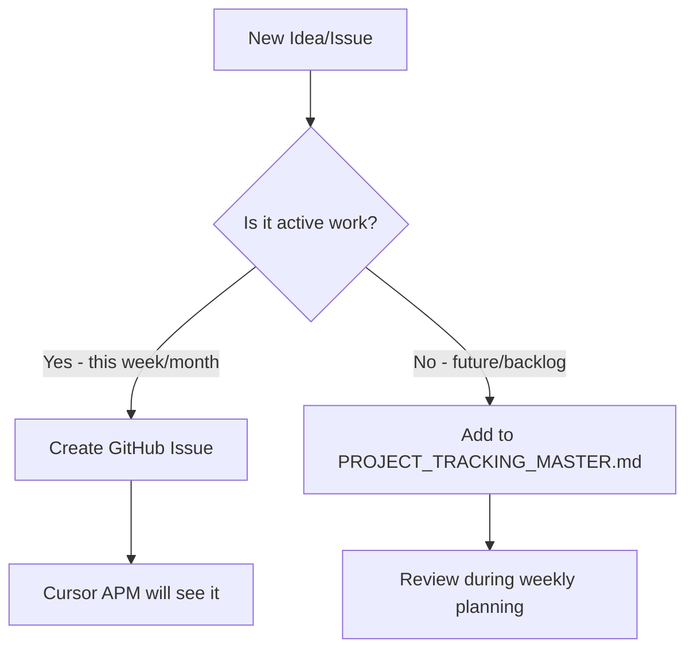

# Issue Tracking Workflow for SAMS

**Last Updated**: October 8, 2025  
**For**: Solo Developer using Cursor + GitHub

---

## Overview

This project uses a **hybrid tracking system** that combines:
- **GitHub Issues** for active work and APM integration
- **Markdown files** for comprehensive tracking and historical context

---

## The System

### 🎯 GitHub Issues (Active Work)
**Use GitHub Issues for:**
- Current sprint items (this week/month)
- Critical and High priority bugs
- Active enhancements being developed
- Anything you want Cursor's APM to integrate

**Labels to Use:**
- `bug` - Something is broken
- `enhancement` - New feature or improvement
- `technical-debt` - Code that needs refactoring/cleanup
- `critical` - Drop everything and fix
- `high-priority` - Address soon
- `medium-priority` - Schedule for upcoming sprint
- `low-priority` - Backlog
- `blocked` - Waiting on something else

### 📋 Markdown System (Comprehensive Tracking)
**Keep these files updated:**

1. **`PROJECT_TRACKING_MASTER.md`** - Your single source of truth
   - High-level view of all work
   - Categorized by priority
   - Includes metrics and status
   - Update weekly or after major changes

2. **`TECHNICAL_DEBT.md`** - Technical debt catalog
   - Detailed debt items with context
   - Triggers for when to address
   - Effort estimates
   - Update when creating or resolving debt

3. **`docs/issues 2/`** - Issue archive
   - Detailed documentation for complex issues
   - Move to `resolved/` when complete
   - Keep as reference/history

4. **`docs/enhancements/`** - Enhancement specifications
   - Detailed specs for major features
   - Design decisions and context
   - Keep for reference during development

---

## Daily Workflow

### When You Think of Something New



**Quick Decision Guide:**
- 🚨 **Critical bug in production?** → GitHub Issue + label `critical`
- 🔥 **Need to fix this week?** → GitHub Issue
- 💡 **Good idea for later?** → Add to `PROJECT_TRACKING_MASTER.md` backlog
- 🧩 **Technical debt discovered?** → Add to `TECHNICAL_DEBT.md`

### When Starting Work

1. **Check GitHub Issues** for assigned/prioritized work
2. **Read `.cursorrules`** to ensure Cursor knows the context
3. **Check `TECHNICAL_DEBT.md`** to avoid working on broken systems
4. **Start work** knowing Cursor's APM has full context

### When Finishing Work

1. **Close GitHub Issue** with resolution notes
2. **Update `PROJECT_TRACKING_MASTER.md`**:
   - Move from Open to Resolved
   - Update metrics
   - Add to Recently Resolved section
3. **Move markdown file** from `docs/issues 2/open/` to `resolved/` (if exists)
4. **Check for new technical debt** - add to `TECHNICAL_DEBT.md` if any

---

## Weekly Planning Ritual

**Every Monday (or your planning day):**

1. **Review GitHub Issues**
   - Close completed items
   - Re-prioritize based on importance
   - Create new issues for this week's work from backlog

2. **Update `PROJECT_TRACKING_MASTER.md`**
   - Review metrics
   - Update sprint priorities
   - Move items between priority levels
   - Check if any enhancements are ready to promote

3. **Review `TECHNICAL_DEBT.md`**
   - Check if any "Trigger for Cleanup" events occurred
   - Decide if any debt should be addressed this week
   - Update status on in-progress debt items

4. **Sync Decisions**
   - Promote items from markdown backlog to GitHub Issues
   - Archive very old or irrelevant items
   - Update documentation if needed

---

## Making Cursor APM Aware

### The `.cursorrules` File
Cursor automatically reads `.cursorrules` on every session. This file:
- ✅ References your tracking documents
- ✅ Highlights critical technical debt
- ✅ Provides development constraints
- ✅ Links to GitHub Issues

**When to update `.cursorrules`:**
- Critical technical debt is added or resolved
- Development patterns change
- New constraints are discovered
- Important issues need highlighting

### GitHub Issues Integration
Cursor can read GitHub Issues if you:
1. Mention issue numbers in your prompts: "Work on #42"
2. Have the GitHub integration enabled in Cursor
3. Reference issues in commit messages

---

## Hybrid System Benefits

### ✅ Advantages of This Approach

**GitHub Issues:**
- Searchable and filterable
- Can reference in commits
- Cursor can integrate them
- Clean, focused active work list
- Can use GitHub Actions for automation

**Markdown Files:**
- Version controlled with your code
- Richer formatting and context
- Comprehensive historical record
- No external dependencies
- Fast to search/grep
- Great for long-term planning

**Together:**
- Active work is visible to Cursor APM
- Long-term planning stays organized
- Nothing gets lost
- Historical context preserved
- Flexibility to work offline

---

## Quick Reference Commands

### Create a GitHub Issue (from CLI)
```bash
gh issue create --title "[BUG] Description" --label bug,high-priority --body "Details..."
```

### List Open GitHub Issues
```bash
gh issue list --label bug
gh issue list --label enhancement
gh issue list --label high-priority
```

### Search Your Markdown Files
```bash
# Find all open issues
grep -r "Status.*OPEN" docs/issues\ 2/open/

# Find high priority items
grep -r "Priority.*HIGH" PROJECT_TRACKING_MASTER.md

# Search technical debt by priority
grep "Priority: High" TECHNICAL_DEBT.md
```

### Create Issue from Template
```bash
# In Cursor or GitHub web UI
# Go to Issues → New Issue → Choose template
```

---

## Templates

### Quick GitHub Issue Creation

**Bug:**
```
Title: [BUG] Short description
Labels: bug, [priority-label]
Body: 
- What's broken
- Steps to reproduce
- Expected vs actual behavior
- Impact on users
```

**Enhancement:**
```
Title: [ENHANCEMENT] Short description
Labels: enhancement, [priority-label]
Body:
- User story
- Business value
- Proposed solution
- Acceptance criteria
```

### Quick Markdown Entry

**In PROJECT_TRACKING_MASTER.md:**
```markdown
### PRIORITY-XXX: Descriptive Title
- **Module**: [Module Name]
- **Status**: 🔴 OPEN / 📋 BACKLOG
- **Description**: What needs to be done
- **Impact**: How it affects the system
- **Task ID**: ISSUE-YYYYMMDD_HHMM
```

---

## Migration Strategy

### Moving Current Issues to GitHub

**For your current open issues, I recommend:**

1. **Don't migrate everything at once** - Start fresh
2. **Create GitHub Issues only for:**
   - Critical items (like the client logos issue)
   - High priority items you'll work on soon
   - Items blocking production

3. **Keep in markdown:**
   - Medium/Low priority items in backlog
   - Future enhancements not yet planned
   - Historical context and resolved items

4. **As you work:**
   - When you pull an item from backlog → Create GitHub Issue
   - When issue is resolved → Update both systems
   - Gradually adopt the hybrid approach

---

## Maintenance

### Monthly Review
- Archive old resolved issues
- Clean up stale GitHub Issues
- Update metrics in `PROJECT_TRACKING_MASTER.md`
- Review technical debt triggers

### Quarterly Review
- Assess if system is working
- Adjust labels or categories
- Update `.cursorrules` with new patterns
- Clean up old markdown files

---

## FAQs

**Q: Should I create a GitHub Issue for every small bug?**
A: No. Only for things you're actively working on or need to track. Small fixes can go straight to `PROJECT_TRACKING_MASTER.md` or just fix immediately.

**Q: How do I make sure Cursor sees my issues?**
A: Cursor reads `.cursorrules` automatically, and you can mention GitHub issue numbers in your prompts. The APM will also scan open issues if GitHub integration is enabled.

**Q: What if I have 50 backlog items?**
A: Keep them in `PROJECT_TRACKING_MASTER.md`. Only create GitHub Issues when you're ready to work on them. This keeps your active issues list clean and focused.

**Q: Should technical debt be in GitHub or markdown?**
A: `TECHNICAL_DEBT.md` is perfect for comprehensive tracking. Create a GitHub Issue only when you're ready to address specific debt items.

**Q: How do I prevent losing track of important items?**
A: Weekly planning ritual + `.cursorrules` + GitHub labels. The hybrid system ensures nothing falls through the cracks.

---

**Remember**: This system works because it's flexible. Adjust it to match your workflow, not the other way around.
