# Phase 1: Penalty Calculation Complete Flow Diagram

**Investigation Date:** October 15, 2025  
**Agent:** Agent_Water_Investigation_Phase_1  
**Status:** Root Cause Identified

---

## Executive Summary

**ROOT CAUSE IDENTIFIED:** Surgical update after payment skips penalty recalculation entirely.

- ✅ **Full Year Rebuild (Manual Refresh):** Penalties calculated correctly
- ❌ **Surgical Update (After Payment):** Penalties NOT recalculated - uses stale data

---

## Flow A: Full Year Rebuild (Manual Refresh) - ✅ WORKING


### Flow A Details

#### 1. ENTRY POINT
- **File:** `backend/services/waterDataService.js`
- **Function:** `buildYearData(clientId, year)` - Line 350
- **Trigger:** User clicks "Recalculate All Data" button or client selection
- **Frequency:** Manual only (not automatic)

#### 2. PENALTY RECALCULATION (Lines 362-371)
```javascript
console.log(`🔄 Running penalty recalculation for client ${clientId}...`);
try {
  await penaltyRecalculationService.recalculatePenaltiesForClient(clientId);
  console.log(`✅ Penalty recalculation completed for ${clientId}`);
} catch (error) {
  console.error(`❌ Penalty recalculation failed:`, error);
  // Continue with data building even if penalty recalculation fails
}
```
- **Status:** ✅ WORKING
- **Result:** All bill documents updated with correct penalties
- **Performance:** ~1-2 seconds for AVII (10 units × 12 months)

#### 3. PENALTY CALCULATION LOGIC
- **File:** `backend/services/penaltyRecalculationService.js`
- **Function:** `calculatePenaltyForBill()` - Lines 184-249
- **Logic:**
  ```javascript
  // Grace period check
  const gracePeriodEnd = billDueDate + graceDays; // billDueDate + 10 days
  const pastGracePeriod = currentDate > gracePeriodEnd;
  
  if (pastGracePeriod && overdueAmount > 0) {
    // Compounding penalty calculation
    const monthsSinceGrace = getMonthsDifference(gracePeriodEnd, currentDate);
    
    let runningTotal = overdueAmount;
    let totalPenalty = 0;
    
    for (let month = 1; month <= monthsSinceGrace; month++) {
      const monthlyPenalty = runningTotal × penaltyRate; // 5%
      totalPenalty += monthlyPenalty;
      runningTotal += monthlyPenalty;
    }
    
    bill.penaltyAmount = totalPenalty;
    bill.totalAmount = currentCharge + totalPenalty;
  }
  ```

#### 4. STORAGE OPERATION
- **Where Written:** `clients/AVII/projects/waterBills/bills/{YYYY-MM}`
- **Fields Updated:**
  - `bills.units[unitId].penaltyAmount` - Calculated penalty
  - `bills.units[unitId].totalAmount` - currentCharge + penalty
  - `bills.units[unitId].lastPenaltyUpdate` - Timestamp
- **Write Method:** `billDoc.ref.set(billData, { merge: true })` - Line 139

#### 5. DATA AGGREGATION
- **Function:** `buildMonthData()` - Lines 586-760
- **Behavior:** Reads penalties from freshly updated bill documents
- **Code:** 
  ```javascript
  const bill = bills?.bills?.units?.[unitId];
  const penaltyAmount = bill.penaltyAmount || 0; // Reads updated value ✅
  ```

#### 6. UI INTEGRATION
- **Display Location:** Water Bills table, "Penalties" column
- **Data Source:** aggregatedData.months[M].units[unitId].penaltyAmount
- **Status:** ✅ Shows correct penalties after manual refresh

---

## Flow B: Surgical Update After Payment - ❌ BROKEN

```mermaid
flowchart TD
    A[User Makes Payment] --> B[waterPaymentsService.recordPayment]
    
    B --> C[Update Bill Documents]
    C --> D[Mark Bills as Paid]
    D --> E[bills.units.paidAmount += payment]
    E --> F[bills.units.status = paid]
    
    F --> G[Create Transaction]
    G --> H[Split Allocations Base + Penalty]
    
    H --> I[Call Surgical Update]
    I --> J[waterDataService.updateAggregatedDataAfterPayment]
    
    J --> K{❌ MISSING STEP}
    K -.->|Should Call| L[penaltyRecalculationService]
    L -.->|But Doesn't| K
    
    K --> M[Read Current aggregatedData]
    M --> N{For Each Affected Unit}
    
    N --> O[buildSingleUnitData with existingUnitData]
    
    O --> P{Has Existing Data?}
    P -->|Yes| Q[⚡ FAST PATH]
    P -->|No| R[Full Calculation]
    
    Q --> S[Fetch ONLY Bill Document]
    S --> T[Spread Existing Data]
    T --> U[...existingUnitData]
    
    U --> V{Update Only Payment Fields}
    V --> W[paidAmount = bill.paidAmount]
    V --> X[unpaidAmount = recalc]
    V --> Y[status = calculateStatus]
    
    W --> Z[Return Unit Data]
    X --> Z
    Y --> Z
    
    Z --> AA{❌ PROBLEM: Old Penalties}
    AA --> AB[penaltyAmount from existingUnitData]
    AB --> AC[Stale $0 penalty data copied]
    
    AC --> AD[Write to aggregatedData]
    AD --> AE[UI Shows $0 Penalties ❌]
    
    R --> AF[Full Calculation Path]
    AF --> AG[Fetch Readings + Bills + Carryover]
    AG --> AH[Calculate All Fields]
    AH --> AI[Return Unit Data]
    AI --> AD
    
    style K fill:#FF6B6B,stroke:#333,stroke-width:4px
    style Q fill:#FFA500,stroke:#333,stroke-width:3px
    style AA fill:#FF6B6B,stroke:#333,stroke-width:3px
    style AE fill:#FF6B6B,stroke:#333,stroke-width:3px
    style L fill:#90EE90,stroke:#333,stroke-width:2px,stroke-dasharray: 5 5
```



### Flow B Details

#### 1. ENTRY POINT
- **File:** `backend/services/waterPaymentsService.js`
- **Function:** `recordPayment()` - Line 472
- **Trigger:** User submits payment through Water Bills payment modal
- **Called After:** Payment transaction created successfully

#### 2. SURGICAL UPDATE TRIGGER (Line 472)
```javascript
const affectedUnitsAndMonths = billPayments.map(bp => ({
  unitId: bp.unitId,
  monthId: bp.billId
}));
await waterDataService.updateAggregatedDataAfterPayment(clientId, fiscalYear, affectedUnitsAndMonths);
```
- **Status:** ✅ Triggered correctly
- **Problem:** Function doesn't call penalty recalculation

#### 3. ❌ MISSING PENALTY RECALCULATION
- **File:** `backend/services/waterDataService.js`
- **Function:** `updateAggregatedDataAfterPayment()` - Lines 510-580
- **What's Missing:**
  ```javascript
  async updateAggregatedDataAfterPayment(clientId, year, affectedUnitsAndMonths) {
    // ❌ MISSING: Should call penalty recalculation HERE
    // await penaltyRecalculationService.recalculatePenaltiesForClient(clientId);
    
    // Then proceed with surgical update...
  }
  ```
- **Impact:** Penalties never recalculated after payment
- **Result:** Stale penalty data copied to aggregatedData

#### 4. FAST PATH OPTIMIZATION (Lines 186-208)
```javascript
if (existingUnitData) {
  console.log(`⚡ [SURGICAL] Using existing unit data, fetching only updated bill`);
  const bills = await this.fetchBills(clientId, year, month);
  const bill = bills?.bills?.units?.[unitId];
  
  // Update only payment-related fields
  return {
    ...existingUnitData,  // ← SPREADS OLD DATA (including old penalties)
    paidAmount: bill.paidAmount || 0,
    unpaidAmount: bill.totalAmount - (bill.paidAmount || 0),
    status: this.calculateStatus(bill),
    transactionId: ...,
    payments: bill.payments || []
    // ❌ penaltyAmount NOT updated - uses old value from existingUnitData
  };
}
```
- **Performance:** 503-728ms (94% faster than full recalc)
- **Problem:** Reuses old penalty data without checking if penalties should be recalculated

#### 5. STORAGE OPERATION
- **Where Written:** `clients/AVII/projects/waterBills/bills/aggregatedData`
- **Fields Updated:**
  - `months[M].units[unitId].paidAmount` - ✅ Updated correctly
  - `months[M].units[unitId].status` - ✅ Updated correctly
  - `months[M].units[unitId].penaltyAmount` - ❌ OLD VALUE (not recalculated)
- **Result:** aggregatedData contains stale penalty data

#### 6. UI INTEGRATION
- **Display Location:** Water Bills table
- **Data Source:** aggregatedData (with stale penalties)
- **Current Behavior:** Shows $0 penalties even for overdue bills ❌
- **Expected Behavior:** Should show recalculated penalties ✅

---

## Comparison: Working vs Broken

| Aspect | Full Rebuild (Working) | Surgical Update (Broken) |
|--------|------------------------|--------------------------|
| **Trigger** | Manual refresh | After payment |
| **Penalty Recalc** | ✅ Called before aggregation | ❌ NOT CALLED |
| **Bill Documents** | ✅ Updated with new penalties | ⚠️ Updated with payments only |
| **aggregatedData** | ✅ Has current penalties | ❌ Has stale penalties |
| **Performance** | ~8-10 seconds | ~500-700ms |
| **Data Accuracy** | ✅ Correct | ❌ Incorrect |
| **UI Display** | ✅ Shows correct penalties | ❌ Shows $0 penalties |

---

## Integration Points with Other Phases

### Connection to Phase 2 (Payment Cascade)
**What Phase 2 Needs from Phase 1:**
- Accurate penalty amounts for payment allocation
- Bill status (overdue with penalties vs current)
- Total amounts due per unit (base + penalties)

**Current Issue:**
- Phase 2 creates correct split allocations (base + penalty)
- But penalty amounts are $0 because Phase 1 calculation doesn't run

### Connection to Phase 3 (Delete Reversal)
**What Phase 3 Needs from Phase 1:**
- Original penalty amounts (for reversal)
- Penalty calculation history
- When penalties should be reinstated after deletion

**Current Issue:**
- Cascade delete tries to recalculate penalties after reversal
- But same missing trigger - penalties won't update

### Shared Data Structures
**Bill Documents:**
- Phase 1: Calculates `penaltyAmount`
- Phase 2: Reads `penaltyAmount` for split allocations
- Phase 3: Reverts `penaltyAmount` after delete

**aggregatedData:**
- Phase 1: Writes `penaltyAmount` to cache
- Phase 2: Surgical update should refresh `penaltyAmount`
- Phase 3: Surgical update should refresh `penaltyAmount` after delete

---

## The Fix (Hypothesis)

**Simple Solution:**
Add penalty recalculation call to surgical update function.

```javascript
async updateAggregatedDataAfterPayment(clientId, year, affectedUnitsAndMonths) {
  console.log(`🔄 [SURGICAL_UPDATE] Updating aggregated data after payment...`);
  
  // ✅ ADD THIS: Recalculate penalties before surgical update
  try {
    await penaltyRecalculationService.recalculatePenaltiesForClient(clientId);
    console.log(`✅ [SURGICAL_UPDATE] Penalties recalculated`);
  } catch (error) {
    console.error(`❌ [SURGICAL_UPDATE] Penalty recalc failed:`, error);
    // Continue - surgical update can still work
  }
  
  // Then proceed with existing surgical update logic...
  const aggregatedDataRef = db.collection('clients')...
  // ... rest of function unchanged
}
```

**Alternative Solution:**
Force full calculation path instead of fast path when payment made.

```javascript
// In buildSingleUnitData()
if (existingUnitData && !paymentJustMade) {
  // Use fast path only if no payment was just made
  // ...
}
```

**Performance Impact:**
- Simple Solution: +1-2 seconds for penalty recalc (acceptable)
- Alternative: +500ms per unit (worse performance)

**Recommendation:** Simple Solution (add penalty recalc call)

---

## Success Criteria

**Phase 1 Complete When:**
- ✅ Flow A (working) fully documented
- ✅ Flow B (broken) root cause identified
- ✅ Missing penalty recalculation call located
- ✅ Fix approach proposed
- ✅ Integration points documented

**System Fixed When:**
- ✅ Surgical update calls penalty recalculation
- ✅ All units show correct penalties after payment
- ✅ UI displays accurate amounts
- ✅ No manual refresh needed after payment

---

**Document Version:** 1.0  
**Last Updated:** October 15, 2025  
**Next Review:** After fix implementation


