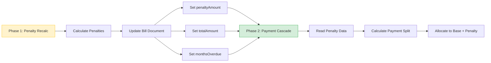
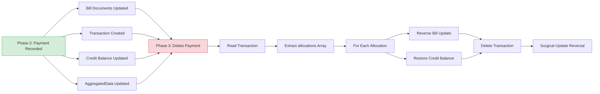
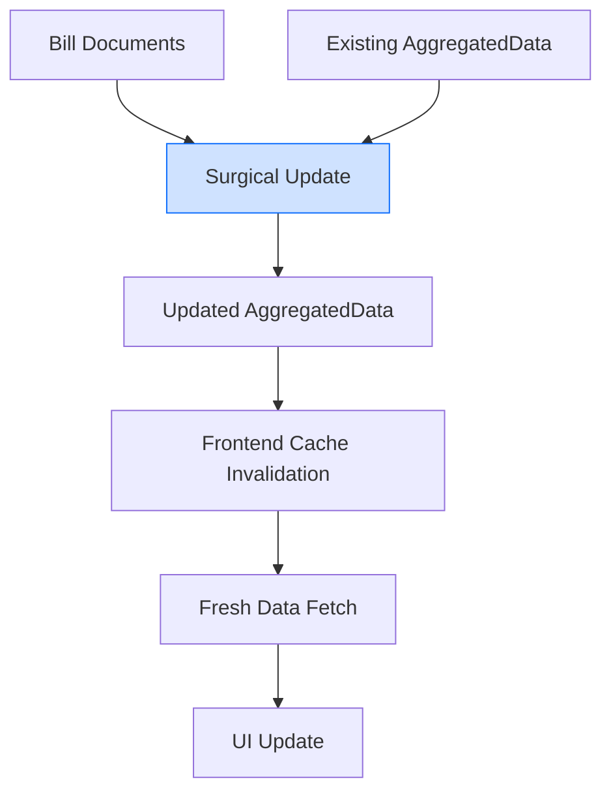

# Phase 2: Integration Points Document

**Investigation Date:** October 15, 2025  
**Agent:** Agent_Water_Investigation_Phase_2  
**Purpose:** Document integration between Phase 2 (Payment Cascade) and Phases 1 & 3

---

## Overview

Phase 2 (Payment Cascade) sits at the center of the water bills payment system:
- **Depends On:** Phase 1 (Penalty Calculation) for penalty amounts
- **Provides To:** Phase 3 (Delete Reversal) for payment data to reverse

---

## A. What Phase 2 Needs from Phase 1 (Penalties)

### Data Dependencies

#### 1. Penalty Amounts

**Phase 1 Calculates:**
- Penalty amount per bill
- Months overdue
- Days overdue
- Last penalty update timestamp

**Stored In:**
```
Firestore Path: clients/{clientId}/projects/waterBills/bills/{billId}
Fields:
  - bills.units.{unitId}.penaltyAmount (dollars)
  - bills.units.{unitId}.monthsOverdue (integer)
  - bills.units.{unitId}.daysOverdue (integer)
  - bills.units.{unitId}.lastPenaltyUpdate (ISO timestamp)
```

**Phase 2 Reads:**
```javascript
// backend/services/waterPaymentsService.js
// Lines 618-620

const storedPenaltyAmount = unitBill.penaltyAmount || 0;
const storedTotalAmount = unitBill.totalAmount || unitBill.currentCharge || 0;
```

**Critical:** Phase 2 uses **STORED** penalty data, NOT real-time calculation

---

#### 2. Total Amount Due

**Phase 1 Should Calculate:**
```javascript
totalAmount = currentCharge + penaltyAmount
```

**Phase 2 Uses:**
```javascript
// backend/services/waterPaymentsService.js
// Line 623

const totalCurrentlyDue = storedTotalAmount - metadata.paidAmount;
```

**Integration Point:**
- Phase 1 MUST update `totalAmount` when penalties recalculated
- If `totalAmount` not updated, payment cascade uses wrong totals

---

#### 3. Bill Status

**Phase 1 Sets Initial Status:**
```javascript
status: "unpaid"  // When bill generated
status: "unpaid"  // After penalties added
```

**Phase 2 Reads Status:**
```javascript
// backend/services/waterPaymentsService.js
// Line 572

if (unitBill && unitBill.status !== 'paid') {
  // Include in unpaid bills array
}
```

**Phase 2 Updates Status:**
```javascript
// Line 714
[`bills.units.${unitId}.status`]: payment.newStatus  // 'paid' or 'partial'
```

---

### Integration Flow: Phase 1 → Phase 2



---

### Potential Integration Issues

#### Issue A: Stale Penalty Data

**Scenario:**
1. Penalty recalculation runs (Phase 1)
2. Penalties updated in bill documents
3. **But:** aggregatedData not immediately updated
4. User sees old penalty in UI
5. User makes payment based on old amount
6. Payment cascade uses STORED penalties (correct)
7. But UI showed wrong amount (user confused)

**Solution:** Phase 1 should trigger surgical update after penalty recalc

---

#### Issue B: Total Amount Not Updated

**Scenario:**
1. Bill generated: currentCharge = $350, penaltyAmount = $0, totalAmount = $350
2. Penalty recalculation: penaltyAmount = $50
3. **Bug:** totalAmount not updated (still $350)
4. Phase 2 calculates: totalDue = $350 - $0 = $350
5. User pays $350 (missing $50 penalty)

**Verification Needed:**
```javascript
// Check if Phase 1 updates totalAmount
totalAmount === currentCharge + penaltyAmount
```

---

#### Issue C: Concurrent Updates

**Scenario:**
1. Phase 1 penalty recalc runs (updates bill)
2. Phase 2 payment processing starts (reads bill)
3. Phase 1 commits update AFTER Phase 2 reads
4. Phase 2 processes with old penalty amount

**Mitigation:** Use Firestore transactions for reads + writes

---

### Data Contract: Phase 1 → Phase 2

**Phase 1 MUST guarantee:**
```javascript
{
  // In bill document
  penaltyAmount: Number,      // Current penalty (dollars)
  totalAmount: Number,        // currentCharge + penaltyAmount
  monthsOverdue: Number,      // Integer
  daysOverdue: Number,        // Integer
  lastPenaltyUpdate: String,  // ISO timestamp
  
  // Invariant
  totalAmount === currentCharge + penaltyAmount
}
```

**Phase 2 MUST handle:**
- Missing penalty fields (default to 0)
- Stale penalty data (use what's stored)
- Partial payment of penalties

---

## B. What Phase 2 Provides to Phase 3 (Delete)

### Data for Reversal

#### 1. Payment Allocation Structure

**Phase 2 Creates:**
```javascript
{
  billPayments: [
    {
      unitId: "203",
      billId: "2026-00",
      billPeriod: "2026-00",
      amountPaid: 399.98,
      baseChargePaid: 350.00,
      penaltyPaid: 49.98,
      newStatus: "paid"
    }
  ],
  creditUsed: 0,
  overpayment: 0,
  newCreditBalance: 0
}
```

**Phase 3 Needs:**
- Which bills were paid (billId list)
- How much paid to each (base vs penalty split)
- Credit balance changes (to reverse)
- Transaction ID (to delete)

---

#### 2. Bill Document Updates

**Phase 2 Updates:**
```javascript
{
  [`bills.units.${unitId}.paidAmount`]: newPaidAmount,     // Was 0, now 399.98
  [`bills.units.${unitId}.basePaid`]: newBasePaid,         // Was 0, now 350.00
  [`bills.units.${unitId}.penaltyPaid`]: newPenaltyPaid,   // Was 0, now 49.98
  [`bills.units.${unitId}.status`]: payment.newStatus,      // Was 'unpaid', now 'paid'
  [`bills.units.${unitId}.payments`]: updatedPayments       // Array appended
}
```

**Phase 3 Must Reverse:**
- Subtract payment from `paidAmount`
- Subtract from `basePaid` and `penaltyPaid`
- Revert status (paid → unpaid, partial → unpaid)
- Remove payment entry from `payments[]` array

---

#### 3. Credit Balance Changes

**Phase 2 Updates HOA Dues:**
```javascript
// Firestore: clients/{clientId}/hoaDues/units/{unitId}
{
  creditBalance: newBalance,  // Changed from old to new
  creditBalanceHistory: [
    ...existing,
    {
      amount: changeAmount,  // +/- in cents
      date: paymentDate,
      transactionId: transactionId,
      note: description
    }
  ]
}
```

**Phase 3 Must Reverse:**
- Restore old credit balance
- Remove credit history entry
- Or add compensating entry

---

#### 4. Transaction Document

**Phase 2 Creates:**
```javascript
{
  transactionId: "2025-10-15_105634_123",
  amount: 39998,  // cents
  type: "income",
  categoryId: "-split-",
  allocations: [
    {
      id: "alloc_001",
      type: "water_bill",
      amount: 35000,  // Base charge
      data: { billId: "2026-00", billType: "base_charge" }
    },
    {
      id: "alloc_002",
      type: "water_penalty",
      amount: 4998,  // Penalty
      data: { billId: "2026-00", billType: "penalty" }
    }
  ]
}
```

**Phase 3 Must Delete:**
- Entire transaction document
- Verify no other references exist

---

### Integration Flow: Phase 2 → Phase 3



---

### Potential Integration Issues

#### Issue A: Partial Reversal

**Scenario:**
1. Phase 2 payment covers 4 bills
2. User wants to delete payment
3. Phase 3 reverses 3 bills successfully
4. 4th bill reversal fails
5. **Result:** Inconsistent state

**Solution:** Phase 3 must use transaction for all-or-nothing reversal

---

#### Issue B: Credit Balance Reversal Timing

**Scenario:**
1. Payment used $100 credit (credit: $500 → $400)
2. User deletes payment
3. Phase 3 restores credit ($400 → $500)
4. **But:** User already made another payment using $400 credit
5. Restoring to $500 creates incorrect balance

**Solution:** Check for subsequent credit usage before reversal

---

#### Issue C: Transaction Already Used in Reports

**Scenario:**
1. Payment recorded, transaction created
2. User runs Statement of Account report (includes this transaction)
3. User deletes payment
4. **Result:** Report now references deleted transaction

**Solution:** Soft delete transaction (mark as void) or prevent deletion if used in reports

---

### Data Contract: Phase 2 → Phase 3

**Phase 2 MUST guarantee:**
```javascript
{
  // Transaction always created
  transactionId: String,
  
  // Allocations always present
  allocations: Array<Allocation>,
  
  // Allocations contain reversal info
  allocations[].data: {
    unitId: String,
    billId: String,
    billType: "base_charge" | "penalty"
  },
  
  // Credit change recorded
  creditChange: {
    oldBalance: Number,
    newBalance: Number,
    changeAmount: Number
  }
}
```

**Phase 3 MUST handle:**
- Multi-bill payments (reverse all or none)
- Partial payments (restore partial status correctly)
- Credit balance conflicts (check for subsequent usage)
- Transaction soft delete vs hard delete

---

## C. Shared Data Structures

### Bill Documents

**Read By:**
- Phase 1: To add penalties
- Phase 2: To determine unpaid amounts
- Phase 3: To reverse payments

**Written By:**
- Phase 1: Penalty updates
- Phase 2: Payment updates
- Phase 3: Reversal updates

**Firestore Path:**
```
clients/{clientId}/projects/waterBills/bills/{billId}
```

**Critical Fields:**
```javascript
{
  bills: {
    units: {
      [unitId]: {
        // Base charge (set at bill generation)
        currentCharge: Number,
        
        // Penalties (set by Phase 1)
        penaltyAmount: Number,
        totalAmount: Number,  // currentCharge + penaltyAmount
        monthsOverdue: Number,
        daysOverdue: Number,
        lastPenaltyUpdate: String,
        
        // Payment tracking (updated by Phase 2, reversed by Phase 3)
        paidAmount: Number,
        basePaid: Number,
        penaltyPaid: Number,
        status: String,  // unpaid | partial | paid
        payments: Array  // Payment history
      }
    }
  }
}
```

**Concurrency Risk:** All 3 phases may update same document

---

### aggregatedData

**Read By:**
- All phases (for UI display)

**Written By:**
- Phase 1: After penalty recalc (should trigger surgical update)
- Phase 2: After payment (surgical update)
- Phase 3: After delete (surgical update reversal)

**Firestore Path:**
```
clients/{clientId}/projects/waterBills/aggregatedData/{fiscalYear}
```

**Critical Fields:**
```javascript
{
  months: [
    {
      month: Number,
      units: {
        [unitId]: {
          // From bill document
          currentCharge: Number,
          penaltyAmount: Number,  // Phase 1
          totalAmount: Number,
          
          // Calculated
          paidAmount: Number,     // Phase 2
          unpaidAmount: Number,   // totalAmount - paidAmount
          status: String,         // Phase 2
          
          // Links
          transactionId: String   // Phase 2
        }
      }
    }
  ]
}
```

**Update Pattern:** Surgical update (only affected units/months)

---

### HOA Dues Credit Balance

**Read By:**
- Phase 2: Before payment (to calculate total funds)

**Written By:**
- Phase 2: After payment (credit used or overpayment)
- Phase 3: After delete (restore credit)

**Firestore Path:**
```
clients/{clientId}/hoaDues/units/{unitId}
```

**Critical Fields:**
```javascript
{
  creditBalance: Number,  // Current balance in dollars
  creditBalanceHistory: [
    {
      amount: Number,         // Change amount in cents
      date: String,
      transactionId: String,  // Links to transaction
      note: String,
      timestamp: String
    }
  ]
}
```

**Integration Risk:** Credit balance lives in different module (HOA Dues)

---

### Transaction Documents

**Read By:**
- Phase 3: To extract allocation data for reversal

**Written By:**
- Phase 2: Created during payment

**Deleted By:**
- Phase 3: Payment reversal

**Firestore Path:**
```
clients/{clientId}/transactions/{transactionId}
```

**Critical Fields:**
```javascript
{
  transactionId: String,
  amount: Number,  // Total in cents
  type: "income",
  categoryId: String,  // "-split-" for multi-allocation
  
  // CRITICAL for Phase 3
  allocations: [
    {
      id: String,
      type: String,  // "water_bill" | "water_penalty" | "water_credit"
      amount: Number,  // In cents
      data: {
        unitId: String,
        billId: String,
        billType: String  // "base_charge" | "penalty"
      }
    }
  ],
  
  // Metadata for reversal
  metadata: {
    billPayments: Array,  // Original payment structure
    totalBaseCharges: Number,
    totalPenalties: Number
  }
}
```

---

## D. Surgical Update Integration

### What Surgical Update Does

**Purpose:** Update aggregatedData for only affected units/months (not full rebuild)

**When Triggered:**
- Phase 1: After penalty recalculation (should, but might not currently)
- Phase 2: After payment (yes, currently implemented)
- Phase 3: After payment delete (should)

**Performance:**
- Single unit/month: ~728ms backend
- Multi-unit/month: ~503ms for 4 months
- 94% faster than full recalculation

---

### Integration with Phases

#### Phase 1 → Surgical Update

**Current State:** Unknown if Phase 1 triggers surgical update

**Should Do:**
```javascript
// After penalty recalculation
await waterDataService.updateAggregatedDataAfterPenaltyRecalc(
  clientId,
  fiscalYear,
  affectedUnitsAndMonths  // All units with updated penalties
);
```

**If Not Implemented:**
- Penalties updated in bill documents ✓
- But aggregatedData shows old penalties ✗
- UI displays stale penalty amounts
- User sees wrong total due

---

#### Phase 2 → Surgical Update

**Current State:** Implemented (lines 466-477 in waterPaymentsService.js)

**Does:**
```javascript
try {
  const affectedUnitsAndMonths = billPayments.map(bp => ({
    unitId: bp.unitId,
    monthId: bp.billId
  }));
  
  await waterDataService.updateAggregatedDataAfterPayment(
    clientId,
    fiscalYear,
    affectedUnitsAndMonths
  );
  
  console.log(`✅ [PAYMENT] Surgical update completed`);
} catch (error) {
  console.warn(`⚠️ [PAYMENT] Surgical update failed (non-critical):`, error.message);
  // Payment still succeeds
}
```

**Error Handling:** Non-critical (payment succeeds even if surgical update fails)

**Issue:** If surgical update fails, UI shows stale data until manual refresh

---

#### Phase 3 → Surgical Update

**Should Do:**
```javascript
// After payment reversal
await waterDataService.updateAggregatedDataAfterPaymentReversal(
  clientId,
  fiscalYear,
  affectedUnitsAndMonths  // Same units/months as original payment
);
```

**Must Update:**
- Restore unpaidAmount (totalAmount - paidAmount after reversal)
- Restore status (paid → unpaid, partial → unpaid)
- Remove transactionId link
- Recalculate month totals
- Recalculate year summary

---

### Surgical Update Data Dependencies

**Reads From:**
- Bill documents (for updated payment info)
- Existing aggregatedData (for fast-path optimization)

**Writes To:**
- aggregatedData document (only affected units/months)

**Dependencies:**


---

## E. Cross-Phase Dependencies

### Dependency Chain

```
Phase 1 (Penalties)
  ↓ Provides: penaltyAmount, totalAmount
  ↓
Phase 2 (Payment)
  ↓ Provides: allocations, transaction, credit changes
  ↓
Phase 3 (Delete)
  ↓ Uses: allocations to reverse payment
```

### Critical Integration Points

1. **Phase 1 → Phase 2:**
   - Penalty data must be current
   - totalAmount must equal currentCharge + penaltyAmount
   - Surgical update needed after penalty recalc

2. **Phase 2 → Phase 3:**
   - Transaction must contain complete allocation data
   - Credit balance changes must be tracked
   - Bill updates must be reversible

3. **All Phases → Surgical Update:**
   - Must trigger after data changes
   - Must update aggregatedData consistently
   - Must handle failures gracefully

---

## F. Potential Conflicts

### Conflict 1: Concurrent Penalty and Payment

**Scenario:**
1. Phase 1 penalty recalc starts (updates bills)
2. Phase 2 payment starts (reads bills)
3. Phase 1 commits (penalties changed)
4. Phase 2 commits (payment uses old penalties)

**Result:** Payment amount doesn't match current penalties

**Solution:** Use Firestore transactions or optimistic locking

---

### Conflict 2: Payment During Delete

**Scenario:**
1. Phase 3 delete starts (reads transaction)
2. User makes new payment (Phase 2)
3. Phase 3 reverses bill updates
4. Phase 2 commits new payment
5. Phase 3 completes delete

**Result:** New payment partially overwritten by delete reversal

**Solution:** Lock bill during delete operation

---

### Conflict 3: Multiple Surgical Updates

**Scenario:**
1. Phase 1 triggers surgical update (penalties)
2. Phase 2 triggers surgical update (payment)
3. Both read existing aggregatedData
4. Both write back updated data
5. Last write wins (one update lost)

**Result:** aggregatedData missing one update

**Solution:** Queue surgical updates or use Firestore transactions

---

## G. Testing Integration Points

### Test 1: Phase 1 → Phase 2

**Scenario:** Penalty updates reflected in payment

1. Start with unpaid bill: $350 base, $0 penalty
2. Run penalty recalc: adds $50 penalty
3. Verify: totalAmount = $400
4. Make payment: $400
5. Verify: Both base and penalty paid

**Expected:**
- Payment cascade uses current penalty ($50)
- Creates separate allocations for base ($350) and penalty ($50)

---

### Test 2: Phase 2 → Phase 3

**Scenario:** Payment can be fully reversed

1. Make payment: Unit 203, $399.98
2. Verify: Transaction created with allocations
3. Verify: Bills updated (paidAmount, status)
4. Verify: Credit balance changed
5. Delete payment
6. Verify: Bills restored to unpaid
7. Verify: Credit balance restored
8. Verify: Transaction deleted/voided

**Expected:**
- All Phase 2 changes successfully reversed
- System returns to pre-payment state

---

### Test 3: All Phases + Surgical Update

**Scenario:** End-to-end with UI verification

1. Run penalty recalc (Phase 1)
2. Verify: UI shows updated penalties (surgical update worked)
3. Make payment (Phase 2)
4. Verify: UI shows "PAID" immediately (surgical update worked)
5. Delete payment (Phase 3)
6. Verify: UI shows "UNPAID" immediately (surgical update reversal worked)

**Expected:**
- UI updates at each phase without manual refresh
- Surgical updates propagate changes immediately

---

## Summary: Critical Integration Points

| Integration | Data Flow | Current State | Issues |
|-------------|-----------|---------------|--------|
| **Phase 1 → 2** | Penalty data | ✓ Working | Might need surgical update trigger |
| **Phase 2 → 3** | Allocations | ✓ Working | Delete reversal not tested |
| **All → Surgical** | Data updates | ⚠️ Partial | Phase 2 works, Phase 1/3 unknown |
| **Credit Balance** | HOA integration | ⚠️ Issues | Not refreshing in UI |
| **Concurrency** | Multiple updates | ❌ Risk | No locking mechanism |

---

**Status:** All integration points documented. Phase 2 is central hub for payment data flow. Critical dependencies and potential conflicts identified.


