# Phase 2: Payment Cascade Complete Flow Diagram

**Investigation Date:** October 15, 2025  
**Agent:** Agent_Water_Investigation_Phase_2  
**Status:** Code Analysis Complete - Live Testing Pending

---

## Complete Payment Cascade Flow

```mermaid
flowchart TD
    A[User Clicks UNPAID Button] --> B[Payment Modal Opens]
    B --> C[Load Unpaid Bills Data]
    C --> D[API: GET /water/clients/AVII/bills/unpaid/:unitId]
    D --> E[Backend: waterPaymentsController.js]
    E --> F[Service: waterPaymentsService.js]
    F --> G[_getUnpaidBillsForUnit Method]
    G --> H{Bills Found?}
    H -->|No| I[Return Empty Array]
    H -->|Yes| J[Sort Bills by Date Oldest First]
    J --> K[Return Bills Array to Frontend]
    K --> L[Modal Displays Bills + Credit Balance]
    L --> M[User Enters Amount + Payment Details]
    M --> N[Calculate Payment Distribution Frontend]
    N --> O[User Clicks Submit]
    O --> P[API: POST /water/clients/AVII/payments/record]
    P --> Q[Backend: recordPayment Method Line 198]
    
    Q --> R[STEP 1: Get Credit Balance from HOA Dues]
    R --> S[_getCreditBalance Line 496]
    S --> T[HOA Controller: getUnitDuesData]
    T --> U[Return Current Credit Balance]
    
    U --> V[STEP 2: Calculate Total Available Funds]
    V --> W[Payment Amount + Credit Balance = Total]
    
    W --> X[STEP 3: Get Unpaid Bills]
    X --> Y[_getUnpaidBillsForUnit Line 555]
    Y --> Z{Bills Found?}
    
    Z -->|No Bills| AA[All funds → Credit Balance]
    AA --> AB[Update HOA Dues Credit]
    AB --> AC[Create Transaction credit only]
    AC --> AD[Return Success]
    
    Z -->|Has Bills| AE[STEP 4: Allocate Payment Line 302-368]
    AE --> AF[Loop Through Bills Oldest First]
    
    AF --> AG{Remaining Funds > 0?}
    AG -->|No| AH[Exit Loop]
    AG -->|Yes| AI[Get Bill Unpaid Amounts]
    
    AI --> AJ[Base Due = currentCharge - basePaid]
    AJ --> AK[Penalty Due = penaltyAmount - penaltyPaid]
    
    AK --> AL{Funds >= Total Due?}
    AL -->|Yes| AM[Pay Bill in Full]
    AL -->|No| AN[Partial Payment]
    
    AM --> AO[Apply to Base Charge]
    AO --> AP[Apply to Penalties]
    AP --> AQ[Add to billPayments Array]
    AQ --> AR[Subtract from Remaining Funds]
    AR --> AF
    
    AN --> AS[Apply Funds to Base First]
    AS --> AT{Funds Left After Base?}
    AT -->|Yes| AU[Apply Remainder to Penalties]
    AT -->|No| AV[Base Partially Paid]
    AU --> AV
    AV --> AW[Add to billPayments Array]
    AW --> AX[Set Remaining Funds = 0]
    AX --> AH
    
    AH --> AY[STEP 5: Calculate Credit Changes Line 370-383]
    AY --> AZ[New Credit = Remaining Funds]
    AZ --> BA{New Credit >= Old Credit?}
    BA -->|Yes| BB[Overpayment Scenario]
    BA -->|No| BC[Credit Used Scenario]
    BB --> BD[Overpayment = New - Old]
    BC --> BE[Credit Used = Old - New]
    
    BD --> BF[STEP 6: Update HOA Credit Balance]
    BE --> BF
    BF --> BG[_updateCreditBalance Line 525]
    BG --> BH[HOA Controller: updateCreditBalance]
    BH --> BI[Write to HOA Dues Document]
    
    BI --> BJ[STEP 7: Create Split Allocations Line 407-409]
    BJ --> BK[createWaterBillsAllocations Line 25]
    BK --> BL[Loop billPayments Array]
    
    BL --> BM{Base Charge Paid > 0?}
    BM -->|Yes| BN[Create Base Allocation]
    BM -->|No| BO{Penalty Paid > 0?}
    BN --> BO
    
    BO -->|Yes| BP[Create Penalty Allocation]
    BO -->|No| BQ[Continue Loop]
    BP --> BQ
    
    BQ --> BR{More Bills?}
    BR -->|Yes| BL
    BR -->|No| BS{Overpayment > 0?}
    
    BS -->|Yes| BT[Create Credit Allocation Positive]
    BS -->|No| BU{Credit Used > 0?}
    BU -->|Yes| BV[Create Credit Allocation Negative]
    BU -->|No| BW[Allocations Complete]
    BT --> BW
    BV --> BW
    
    BW --> BX[STEP 8: Create Transaction Line 455]
    BX --> BY[transactionsController.createTransaction]
    BY --> BZ{Multiple Allocations?}
    BZ -->|Yes| CA[Category = -split-]
    BZ -->|No| CB[Category = water-consumption]
    CA --> CC[Write Transaction Document]
    CB --> CC
    CC --> CD[Return Transaction ID]
    
    CD --> CE[STEP 9: Update Bill Documents Line 459]
    CE --> CF[_updateBillsWithPayments Line 655]
    CF --> CG[Firestore Batch Write]
    CG --> CH[For Each Bill Payment]
    
    CH --> CI[Update paidAmount]
    CI --> CJ[Update basePaid]
    CJ --> CK[Update penaltyPaid]
    CK --> CL[Update status paid/partial]
    CL --> CM[Append to payments Array]
    CM --> CN[Batch Commit]
    
    CN --> CO[STEP 10: Surgical Update Line 472]
    CO --> CP[waterDataService.updateAggregatedDataAfterPayment]
    CP --> CQ[Build affectedUnitsAndMonths Array]
    CQ --> CR[For Each Affected Month]
    CR --> CS[buildSingleUnitData with existing data]
    CS --> CT[Update aggregatedData Document]
    CT --> CU[Recalculate Year Summary]
    
    CU --> CV[STEP 11: Return Success to Frontend]
    CV --> CW[Frontend Payment Modal onSuccess]
    CW --> CX[Call refreshData]
    CX --> CY[Clear Cache]
    CY --> CZ[Fetch Fresh Data]
    CZ --> DA[UI Updates Display]
    
    DA --> DB{UI Shows PAID?}
    DB -->|Yes| DC[SUCCESS - Flow Complete]
    DB -->|No| DD[ISSUE - UI Not Updating]
    
    style Q fill:#e1f5ff,stroke:#0366d6,stroke-width:3px
    style AE fill:#fff3cd,stroke:#ffc107,stroke-width:3px
    style BK fill:#d4edda,stroke:#28a745,stroke-width:3px
    style BY fill:#f8d7da,stroke:#dc3545,stroke-width:3px
    style CP fill:#cfe2ff,stroke:#0d6efd,stroke-width:3px
    style DD fill:#f8d7da,stroke:#dc3545,stroke-width:4px
```



---

## Detailed Step-by-Step Documentation

### 1. ENTRY POINT - User Initiates Payment

**File:** `frontend/sams-ui/src/components/water/WaterBillsList.jsx`  
**Lines:** 373-415  
**Function:** `handleStatusClick()`

**What Happens:**
- User clicks on "UNPAID" or "PARTIAL" status button
- Frontend opens WaterPaymentModal component
- State: `setSelectedUnitForPayment(unitId)` and `setShowPaymentModal(true)`

**Data Flow:**
```javascript
// Lines 410-414
if (unit.status === 'unpaid' || unit.status === 'partial') {
  setSelectedUnitForPayment(unitId);
  setShowPaymentModal(true);
}
```

---

### 2. PAYMENT DATA COLLECTION - Modal Loads Bills

**File:** `frontend/sams-ui/src/components/water/WaterPaymentModal.jsx`  
**Lines:** 50-71  
**Function:** `loadUnpaidBillsData()`

**What Happens:**
- Modal fetches unpaid bills for the unit
- Fetches current credit balance from HOA Dues
- Auto-fills payment amount with total due

**API Call:**
```javascript
const response = await waterAPI.getUnpaidBillsSummary(selectedClient.id, unitId);
// GET /water/clients/AVII/bills/unpaid/:unitId
```

**Backend Endpoint:**
- **Route:** `backend/routes/waterRoutes.js` → `/bills/unpaid/:unitId`
- **Controller:** `waterPaymentsController.getUnpaidBillsSummary()`
- **Service:** `waterPaymentsService._getUnpaidBillsForUnit()`

---

### 3. BACKEND PAYMENT PROCESSING - recordPayment()

**File:** `backend/services/waterPaymentsService.js`  
**Lines:** 198-491  
**Function:** `recordPayment(clientId, unitId, paymentData)`

**Entry Point:**
```javascript
async recordPayment(clientId, unitId, paymentData) {
  await this._initializeDb();
  
  const { 
    amount, 
    paymentDate = getNow().toISOString().split('T')[0], 
    paymentMethod = 'cash',
    paymentMethodId,
    reference = '',
    notes = '',
    accountId,
    accountType
  } = paymentData;
```

**Validation:**
- Requires: `unitId`, `amount > 0`, `accountId`, `accountType`
- Throws error if validation fails

---

### 4. BILL RETRIEVAL - Finding What to Pay

**File:** `backend/services/waterPaymentsService.js`  
**Lines:** 555-650  
**Function:** `_getUnpaidBillsForUnit(clientId, unitId)`

**Logic:**
1. Query all bill documents from Firestore
2. Filter for bills with `status !== 'paid'` for this unit
3. Calculate unpaid amounts: `totalAmount - paidAmount`
4. Sort by document name (YYYY-MM format = oldest first)
5. Use **STORED** penalty data (not calculated dynamically)

**Important Code:**
```javascript
// Lines 572-574
if (unitBill && unitBill.status !== 'paid') {
  const paidAmount = unitBill.paidAmount || 0;
  const basePaid = unitBill.basePaid || 0;
```

**Returns:**
```javascript
{
  id: '2026-00',           // Bill ID (fiscal year-month)
  period: '2026-00',       // Same as ID
  penaltyAmount: 49.98,    // STORED penalty (not calculated)
  totalAmount: 399.98,     // currentCharge + penalties
  currentCharge: 350.00,   // Base water charge
  paidAmount: 0,           // Already paid amount
  basePaid: 0,            // Amount paid toward base
  penaltyPaid: 0,         // Amount paid toward penalties
  unpaidAmount: 399.98,   // totalAmount - paidAmount
  status: 'unpaid'
}
```

**"NOBILL" Status NOT Set Here:**
- This function only returns bills that exist with `status !== 'paid'`
- Empty array returned if no unpaid bills found
- "NOBILL" is likely set in aggregatedData calculation (different process)

---

### 5. PAYMENT ALLOCATION LOGIC - The Cascade Algorithm

**File:** `backend/services/waterPaymentsService.js`  
**Lines:** 296-368  
**Algorithm:** Cascade payment through bills (oldest first, base before penalties)

**Detailed Logic:**

```javascript
// Line 297: Calculate total available funds
let remainingFunds = totalAvailableFunds; // Payment + Credit Balance
const billPayments = [];

// Line 302: Loop through unpaid bills
for (const bill of unpaidBills) {
  if (remainingFunds <= 0) break;
  
  // Lines 305-307: Calculate what's due
  const unpaidAmount = bill.totalAmount - (bill.paidAmount || 0);
  const baseUnpaid = bill.currentCharge - (bill.basePaid || 0);
  const penaltyUnpaid = bill.penaltyAmount - (bill.penaltyPaid || 0);
  
  // FULL PAYMENT SCENARIO (Lines 311-335)
  if (remainingFunds >= unpaidAmount) {
    billPayments.push({
      unitId: unitId,
      billId: bill.id,
      billPeriod: bill.period,
      amountPaid: unpaidAmount,
      baseChargePaid: baseUnpaid,      // Base paid in full
      penaltyPaid: penaltyUnpaid,      // Penalties paid in full
      newStatus: 'paid'
    });
    remainingFunds -= unpaidAmount;
  }
  
  // PARTIAL PAYMENT SCENARIO (Lines 336-367)
  else if (remainingFunds > 0) {
    let amountToApply = remainingFunds;
    let basePortionPaid = 0;
    let penaltyPortionPaid = 0;
    
    // PRIORITY 1: Pay base charges first
    if (baseUnpaid > 0) {
      basePortionPaid = Math.min(amountToApply, baseUnpaid);
      amountToApply -= basePortionPaid;
    }
    
    // PRIORITY 2: Pay penalties second (if funds remain)
    if (amountToApply > 0 && penaltyUnpaid > 0) {
      penaltyPortionPaid = Math.min(amountToApply, penaltyUnpaid);
    }
    
    billPayments.push({
      unitId: unitId,
      billId: bill.id,
      billPeriod: bill.period,
      amountPaid: remainingFunds,
      baseChargePaid: basePortionPaid,
      penaltyPaid: penaltyPortionPaid,
      newStatus: 'partial'
    });
    
    remainingFunds = 0; // All funds exhausted
  }
}
```

**Key Observations:**
1. **Oldest First:** Bills sorted by ID (YYYY-MM) before loop
2. **Base Before Penalties:** Within each bill, base charge paid before penalties
3. **Full Before Partial:** Each bill paid in full if possible before moving to next
4. **Stops When Empty:** Loop exits when `remainingFunds <= 0`

---

### 6. SPLIT ALLOCATIONS CREATION - Transaction Detail

**File:** `backend/services/waterPaymentsService.js`  
**Lines:** 25-136  
**Function:** `createWaterBillsAllocations(billPayments, unitId, paymentData)`

**Purpose:** Create separate allocation objects for each payment component (base, penalty, credit)

**Algorithm:**
```javascript
const allocations = [];
let allocationIndex = 0;

// Loop through each bill payment
billPayments.forEach((billPayment) => {
  // Allocation 1: Base Charge (if > 0)
  if (billPayment.baseChargePaid > 0) {
    allocations.push({
      id: `alloc_${String(++allocationIndex).padStart(3, '0')}`,
      type: "water_bill",
      targetId: `bill_${billPayment.billId}`,
      targetName: `${billPayment.billPeriod} - Unit ${unitId}`,
      amount: billPayment.baseChargePaid,  // In dollars
      categoryName: "Water Consumption",
      categoryId: "water-consumption",
      data: {
        unitId: unitId,
        billId: billPayment.billId,
        billPeriod: billPayment.billPeriod,
        billType: "base_charge"
      }
    });
  }
  
  // Allocation 2: Penalty (if > 0)
  if (billPayment.penaltyPaid > 0) {
    allocations.push({
      id: `alloc_${String(++allocationIndex).padStart(3, '0')}`,
      type: "water_penalty",
      targetId: `penalty_${billPayment.billId}`,
      targetName: `${billPayment.billPeriod} Penalties - Unit ${unitId}`,
      amount: billPayment.penaltyPaid,  // In dollars
      categoryName: "Water Penalties",
      categoryId: "water-penalties",
      data: {
        unitId: unitId,
        billId: billPayment.billId,
        billPeriod: billPayment.billPeriod,
        billType: "penalty"
      }
    });
  }
});

// Allocation 3: Credit Balance (if overpayment)
if (paymentData.overpayment > 0) {
  allocations.push({
    type: "water_credit",
    amount: paymentData.overpayment,  // Positive
    categoryName: "Account Credit",
    categoryId: "account-credit"
  });
}

// Allocation 4: Credit Usage (if credit used)
if (paymentData.creditUsed > 0) {
  allocations.push({
    type: "water_credit",
    amount: -paymentData.creditUsed,  // Negative
    categoryName: "Account Credit",
    categoryId: "account-credit"
  });
}

return allocations;
```

**Critical Pattern:**
- **Amounts in DOLLARS** (transactionsController converts to cents at line 362)
- **Separate allocations** for base vs penalty (not combined)
- **Credit as allocation** (positive for overpayment, negative for usage)

---

### 7. BILL DOCUMENT UPDATES - Storing Payment Info

**File:** `backend/services/waterPaymentsService.js`  
**Lines:** 655-720  
**Function:** `_updateBillsWithPayments(clientId, unitId, billPayments, ...)`

**Firestore Path:**
```
clients/{clientId}/projects/waterBills/bills/{billId}
```

**Updates Applied (Batch Write):**
```javascript
// For each bill in billPayments array
batch.update(billRef, {
  [`bills.units.${unitId}.paidAmount`]: newPaidAmount,      // Add payment amount
  [`bills.units.${unitId}.basePaid`]: newBasePaid,          // Track base paid
  [`bills.units.${unitId}.penaltyPaid`]: newPenaltyPaid,    // Track penalty paid
  [`bills.units.${unitId}.status`]: payment.newStatus,       // Change to 'paid' or 'partial'
  [`bills.units.${unitId}.payments`]: updatedPayments        // Append payment entry
});
```

**Payment Entry Structure:**
```javascript
{
  amount: displayPaidAmount,           // Display amount
  baseChargePaid: payment.baseChargePaid,
  penaltyPaid: payment.penaltyPaid,
  date: paymentDate,
  method: paymentMethod,
  reference: reference,
  transactionId: transactionResult,    // Links to transaction
  recordedAt: getNow().toISOString()
}
```

---

### 8. TRANSACTION CREATION - Accounting Record

**File:** `backend/controllers/transactionsController.js`  
**Function:** `createTransaction(clientId, transactionData)`

**Data Sent:**
```javascript
const transactionData = {
  amount: amount,                    // Total payment (dollars)
  type: 'income',
  categoryId: allocations.length > 1 ? "-split-" : "water-consumption",
  categoryName: allocations.length > 1 ? "-Split-" : "Water Consumption",
  description: `Water Bill Payment - Unit ${unitId}`,
  unitId: unitId,
  accountId: accountId,
  accountType: accountType,
  paymentMethod: paymentMethod,
  paymentMethodId: paymentMethodId,
  reference: reference,
  notes: enhancedNotes,
  date: paymentDate,
  
  // CRITICAL: Allocations array
  allocations: allocations,  // From createWaterBillsAllocations()
  
  metadata: {
    billPayments: billPayments.map(bp => ({
      period: bp.billPeriod,
      amountPaid: bp.amountPaid,
      baseChargePaid: bp.baseChargePaid,
      penaltyPaid: bp.penaltyPaid
    })),
    totalBaseCharges: totalBaseChargesPaid,
    totalPenalties: totalPenaltiesPaid,
    paymentType: 'bills_and_credit'
  }
};
```

**Controller Processing:**
- Converts allocation amounts from dollars to cents (line 362)
- Generates transaction ID
- Writes to Firestore `clients/{clientId}/transactions/{transactionId}`
- Returns transaction ID

---

### 9. CREDIT BALANCE INTEGRATION - HOA Dues Update

**File:** `backend/services/waterPaymentsService.js`  
**Lines:** 496-549  
**Functions:** `_getCreditBalance()` and `_updateCreditBalance()`

**Credit Balance Location:**
```
Firestore Path: clients/{clientId}/hoaDues/units/{unitId}
Field: creditBalance (in dollars)
```

**Read Credit (Lines 496-520):**
```javascript
async _getCreditBalance(clientId, unitId, year) {
  const { getUnitDuesData } = await import('../controllers/hoaDuesController.js');
  const duesData = await getUnitDuesData(clientId, unitId, year);
  return {
    creditBalance: duesData.creditBalance || 0,
    creditBalanceHistory: duesData.creditBalanceHistory || []
  };
}
```

**Update Credit (Lines 525-549):**
```javascript
async _updateCreditBalance(clientId, unitId, year, updateData) {
  const { updateCreditBalance } = await import('../controllers/hoaDuesController.js');
  const { newBalance, changeAmount, changeType, description } = updateData;
  
  await updateCreditBalance(clientId, unitId, year, newBalance);
  
  return {
    success: true,
    newBalance: newBalance,
    changeAmount: changeAmount
  };
}
```

**Issue Potential:**
- Credit balance updated via HOA controller
- **Timing:** Updated BEFORE transaction created (line 388)
- **Problem:** If frontend doesn't refresh, won't see updated credit
- **Expected:** Surgical update should trigger cache invalidation

---

### 10. SURGICAL UPDATE TRIGGER - Real-Time UI Refresh

**File:** `backend/services/waterPaymentsService.js`  
**Lines:** 466-477  
**Calls:** `waterDataService.updateAggregatedDataAfterPayment()`

**Code:**
```javascript
try {
  // Build array of affected units and months
  const affectedUnitsAndMonths = billPayments.map(bp => ({
    unitId: bp.unitId,
    monthId: bp.billId  // e.g., "2026-00"
  }));
  
  // Surgical update (from Priority 1 work)
  await waterDataService.updateAggregatedDataAfterPayment(
    clientId, 
    fiscalYear, 
    affectedUnitsAndMonths
  );
  
  console.log(`✅ [PAYMENT] Surgical update completed`);
} catch (error) {
  console.warn(`⚠️ [PAYMENT] Surgical update failed (non-critical):`, error.message);
  // Payment still succeeds even if surgical update fails
}
```

**What Surgical Update Should Do:**
1. Retrieve existing aggregatedData document
2. For each affected month, call `buildSingleUnitData()` with existing data
3. Update only the specific unit's data in that month
4. Recalculate year summary
5. Write updated aggregatedData back to Firestore

**Performance (from Memory Log):**
- Single month: ~728ms backend, ~1009ms total
- Multi-month (4): ~503ms backend, ~796ms total
- 94% faster than full recalculation

---

### 11. FRONTEND RESPONSE - UI Update Trigger

**File:** `frontend/sams-ui/src/components/water/WaterPaymentModal.jsx`  
**Lines:** 248-251  
**Success Callback:**

```javascript
if (response.data.success) {
  console.log('✅ Water payment recorded successfully:', response.data);
  onSuccess();  // Calls parent's success handler
  onClose();    // Closes modal
}
```

**File:** `frontend/sams-ui/src/components/water/WaterBillsList.jsx`  
**Lines:** 547-551  
**Parent Success Handler:**

```javascript
onSuccess={() => {
  refreshData();  // Triggers cache invalidation and fetch
  console.log('✅ Payment recorded - refreshing bill data');
}}
```

**File:** `frontend/sams-ui/src/context/WaterBillsContext.jsx`  
**Function:** `refreshData()` or `clearCacheAndRefresh()`

**Expected Behavior:**
1. Clear sessionStorage cache for water bills
2. Fetch fresh data from backend (includes updated bill status)
3. React state updates
4. UI re-renders showing "PAID" status

---

## Integration Point: Where Issues Occur

### Issue 1: Credit Balance Not Updating Until Reload
**Expected Flow:**
1. Payment recorded → Credit balance updated in HOA Dues
2. Surgical update triggers → aggregatedData updated
3. Frontend refreshData() called → Cache cleared
4. Fresh data fetched → UI updates

**Potential Gap:**
- Frontend refreshData() only refreshes Water Bills data
- Credit balance lives in HOA Dues context (different context)
- HOA Dues context might not be invalidated
- **Hypothesis:** Need to trigger HOA Dues context refresh after water payment

---

### Issue 2: Paid Bill Amounts Not Cleared
**Expected Flow:**
1. Bill status changed to "paid" in bill document
2. Surgical update rebuilds unit data in aggregatedData
3. Frontend fetch gets updated aggregatedData
4. UI displays updated status and amounts

**Potential Gap:**
- Bill status updated correctly ✓
- Surgical update called ✓
- **Question:** Does surgical update properly calculate `unpaidAmount = 0` for paid bills?
- **Question:** Does frontend display logic handle paid bills correctly?

---

### Issue 3: Due Amount Shows After Refresh/Recalc
**Expected Flow:**
1. After payment, due amount should be $0
2. Full refresh (10s recalc) rebuilds all data
3. Browser reload fetches fresh data
4. Should show $0 due

**Potential Gap:**
- If still shows due amount after full rebuild, issue is in data calculation
- **Question:** Does `buildSingleUnitData()` properly calculate `unpaidAmount`?
- **Question:** Are bill document updates actually committed?

---

### Issue 4: "NOBILL" Error Blocks Overdue Payments
**Finding from Code Analysis:**
- Frontend payment modal has NO "NOBILL" check
- Frontend allows payment even with 0 unpaid bills (goes to credit)
- "NOBILL" is a CSS class but not actively used in status display
- `getStatusClass()` only returns: 'paid', 'partial', 'unpaid'

**Hypothesis:**
- "NOBILL" status might be set in aggregatedData calculation
- If unit has no bill generated for current month but has overdue bills
- Frontend might be checking current month status instead of overall unpaid
- **Need to investigate:** Where is "NOBILL" status actually set?

---

## Key Code References

| Component | File | Lines | Purpose |
|-----------|------|-------|---------|
| **Payment Entry** | waterPaymentsService.js | 198-491 | Main payment logic |
| **Bill Retrieval** | waterPaymentsService.js | 555-650 | Get unpaid bills |
| **Allocation** | waterPaymentsService.js | 302-368 | Cascade algorithm |
| **Split Creation** | waterPaymentsService.js | 25-136 | Create allocations |
| **Bill Updates** | waterPaymentsService.js | 655-720 | Update documents |
| **Transaction** | transactionsController.js | - | Create transaction |
| **Credit Balance** | waterPaymentsService.js | 496-549 | HOA integration |
| **Surgical Update** | waterDataService.js | - | Update aggregatedData |
| **Frontend Modal** | WaterPaymentModal.jsx | 200-259 | Submit handler |
| **Frontend Refresh** | WaterBillsList.jsx | 547-551 | Success callback |

---

## Next Steps for Live Testing

**Once servers are running, test:**

1. **Credit Balance Issue:**
   - Note starting credit in HOA Dues
   - Make water payment using credit
   - Check HOA Dues credit immediately (before reload)
   - Expected: Updated | Actual: Document observation

2. **Bill Amounts Issue:**
   - Make payment on unpaid bill
   - Check status changed to "PAID"
   - Check due amount cleared
   - Expected: $0 | Actual: Document observation

3. **Refresh Issue:**
   - Make payment
   - Click Refresh button (full recalc)
   - Reload browser
   - Expected: $0 due | Actual: Document observation

4. **"NOBILL" Issue:**
   - Find unit with overdue bills but no current usage
   - Try to open payment modal
   - Expected: Modal opens | Actual: Document observation

---

**Status:** Flow completely mapped from code. Live testing will confirm or identify gaps in expected vs actual behavior.


