# Phase 3: Water Bills Delete/Reversal Flow Diagram

**Investigation Date:** October 15, 2025  
**Agent:** Agent_Water_Investigation_Phase_3  
**Status:** Complete - Code Analysis Based

---

## Complete Delete Transaction Flow (Mermaid Diagram)

```mermaid
flowchart TD
    Start[User Clicks Delete Button] --> B[Confirmation Dialog]
    B -->|Confirm| C[API Call: DELETE /transactions/:id]
    C --> D[deleteTransaction Controller]
    D --> E[Read Transaction Document]
    E --> F{Transaction Exists?}
    F -->|No| G[Return Error: Not Found]
    F -->|Yes| H[Detect Transaction Type]
    H --> I{Category Detection}
    I -->|category === 'HOA Dues'| J[isHOATransaction = true]
    I -->|categoryId === 'water_payments'| K[isWaterTransaction = true]
    I -->|Other| L[Neither - Simple Delete]
    
    J --> M[Start Firestore Transaction]
    K --> M
    L --> M
    
    M --> N[PHASE 1: ALL READS]
    
    N --> O{HOA Transaction?}
    O -->|Yes| P[Read HOA Dues Document]
    O -->|No| Q[Skip HOA Read]
    P --> R[Store duesDoc, duesData]
    Q --> R
    
    R --> S{Water Transaction?}
    S -->|Yes| T[Query All Water Bill Docs]
    T --> U[For Each Bill Document]
    U --> V{Bill.lastPayment.transactionId === txnId?}
    V -->|Yes| W[Add to waterBillDocs Array]
    V -->|No| U
    W --> U
    U -->|Done| X[Store waterBillDocs Array]
    S -->|No| Y[Skip Water Read]
    X --> Z[PHASE 2: ALL WRITES]
    Y --> Z
    
    Z --> AA[Delete Transaction Document]
    AA --> AB[Update Account Balance]
    
    AB --> AC{isHOATransaction?}
    AC -->|Yes + Has Data| AD[executeHOADuesCleanupWrite]
    AC -->|No| AE[Skip HOA Cleanup]
    
    AD --> AF[HOA: Analyze Credit History]
    AF --> AG[HOA: Calculate Credit Reversal]
    AG --> AH[HOA: Clear Payment Entries]
    AH --> AI[HOA: Update Credit Balance History]
    AI --> AJ[HOA: Update Dues Document]
    AJ --> AK[Return hoaCleanupDetails]
    AE --> AK
    
    AK --> AL{isWaterTransaction?}
    AL -->|Yes + Has Bills| AM[executeWaterBillsCleanupWrite]
    AL -->|No| AN[Skip Water Cleanup]
    
    AM --> AO[Water: For Each Bill]
    AO --> AP[Water: Read lastPayment]
    AP --> AQ[Water: Calculate Amounts to Reverse]
    AQ --> AR[Water: Update Bill Fields]
    AR --> AS[Water: Clear lastPayment]
    AS --> AO
    AO -->|Done| AT[Return waterCleanupDetails]
    AN --> AT
    
    AT --> AU[Commit Firestore Transaction]
    
    AU --> AV{waterCleanupExecuted?}
    AV -->|Yes| AW[POST-DELETE: Surgical Recalc]
    AV -->|No| AX[Skip Surgical Recalc]
    
    AW --> AY[Import waterDataService]
    AY --> AZ[Extract Fiscal Year from Bill IDs]
    AZ --> BA[Build affectedUnitsAndMonths Array]
    BA --> BB[Call updateAggregatedDataAfterPayment]
    BB --> BC{Surgical Update Success?}
    BC -->|Yes| BD[Log: Surgical Recalc Complete]
    BC -->|Error| BE[Log Warning: Continue Anyway]
    BD --> BF[Rebuild Balances if HOA]
    BE --> BF
    AX --> BF
    
    BF --> BG{hoaCleanupExecuted?}
    BG -->|Yes| BH[Rebuild Account Balances]
    BG -->|No| BI[Skip Balance Rebuild]
    BH --> BJ[Invalidate Caches]
    BI --> BJ
    
    BJ --> BK{waterCleanupExecuted?}
    BK -->|Yes| BL[Invalidate Water Data Cache]
    BK -->|No| BM[Skip Cache Invalidation]
    BL --> BN[Write Audit Log]
    BM --> BN
    
    BN --> BO[Return Success]
    
    style Start fill:#e1f5ff
    style D fill:#fff4e6
    style M fill:#f3e5f5
    style N fill:#e8f5e9
    style Z fill:#fff3e0
    style AD fill:#c8e6c9
    style AM fill:#ffccbc
    style AU fill:#b2dfdb
    style AW fill:#ffe0b2
    style BB fill:#f8bbd0
    style BJ fill:#d1c4e9
    style BO fill:#c5e1a5
    
    style AR fill:#ef9a9a
    style AS fill:#ef9a9a
    style BC fill:#ef9a9a
    style BB fill:#ef9a9a
```



---

## Step-by-Step Flow Documentation

### 1. ENTRY POINT - User Initiates Delete
**Component:** `frontend/sams-ui/src/pages/Transactions.jsx` (or similar transaction UI)  
**Action:** User clicks delete button/icon for a transaction  
**Confirmation:** Standard browser confirm() or custom modal  
**Next:** API call to backend

---

### 2. API CALL - DELETE Request
**Endpoint:** `DELETE /clients/:clientId/transactions/:txnId`  
**Frontend:** API utility function (likely in `frontend/sams-ui/src/api/`)  
**Method:** HTTP DELETE  
**Headers:** Firebase auth token required  
**Next:** Routes to deleteTransaction controller

---

### 3. BACKEND DELETE CONTROLLER - Entry Point
**File:** `backend/controllers/transactionsController.js`  
**Function:** `deleteTransaction(clientId, txnId)`  
**Line:** 696  
**Purpose:** Main entry point for transaction deletion  
**Logging:** "🚀 [BACKEND] deleteTransaction called"

**Actions:**
1. Get Firestore database instance
2. Build transaction reference path
3. Read original transaction document
4. Validate transaction exists
5. Extract transaction data

**Key Variables:**
- `txnRef`: Document reference to transaction
- `originalDoc`: Snapshot of transaction before deletion
- `originalData`: Transaction data object

---

### 4. TRANSACTION TYPE DETECTION
**File:** `backend/controllers/transactionsController.js`  
**Lines:** 725-753  

**HOA Detection Logic:**
```javascript
const isHOATransaction = originalData.category === 'HOA Dues' || 
                        originalData.metadata?.type === 'hoa_dues';
```

**Water Bills Detection Logic:**
```javascript
const isWaterTransaction = originalData.categoryId === 'water_payments' || 
                          originalData.categoryName === 'Water Payments';
```

**Logging:**
- "🏠 [BACKEND] HOA Transaction check: true/false"
- "💧 [BACKEND] Water Transaction check: true/false"

**Decision:** Determines which cleanup logic to execute (if any)

---

### 5. FIRESTORE TRANSACTION START
**File:** `backend/controllers/transactionsController.js`  
**Line:** 761  
**Code:** `await db.runTransaction(async (transaction) => { ... })`

**Purpose:** Ensures atomic operations - all succeed or all fail  
**Critical:** No writes before all reads are complete (Firestore requirement)  
**Scope:** Everything from lines 761-892 happens atomically

---

### 6. PHASE 1: ALL READS FIRST
**Lines:** 762-820  
**Firestore Requirement:** Must complete ALL reads before ANY writes

**6A. Read HOA Dues Document (if applicable)**
**Lines:** 766-787  
**Condition:** `isHOATransaction && metadata.unitId && metadata.year`  
**Path:** `clients/{clientId}/units/{unitId}/dues/{year}`  
**Stored In:** `duesDoc`, `duesData`  
**Purpose:** Need current credit balance and payment history for reversal

**6B. Read Water Bill Documents (if applicable)**
**Lines:** 789-820  
**Condition:** `isWaterTransaction && originalData.unitId`  
**Query:** All documents in `clients/{clientId}/projects/waterBills/bills`  
**Filter:** Bills where `bills.units[unitId].lastPayment.transactionId === txnId`  
**Stored In:** `waterBillDocs` array with structure:
```javascript
{
  ref: billDoc.ref,           // Firestore reference
  id: billDoc.id,              // e.g., "2026-03" (YYYY-MM format)
  data: billData,              // Full bill document data
  unitBill: unitBill           // Specific unit's bill data
}
```
**Purpose:** Identify which bills were paid by this transaction

---

### 7. PHASE 2: ALL WRITES SECOND
**Lines:** 822-892  

**7A. Delete Transaction Document**
**Line:** 825  
**Code:** `transaction.delete(txnRef)`  
**Result:** Transaction document removed from Firestore  
**Status:** ✅ WORKS

**7B. Reverse Account Balance**
**Lines:** 827-836  
**Purpose:** Undo the effect on bank/account balance  
**Code:** `await updateAccountBalance(clientId, accountId, -originalData.amount)`  
**Note:** Wrapped in try/catch, failure logged but doesn't fail deletion

---

### 8. EXECUTE HOA DUES CLEANUP (if applicable)
**Lines:** 838-870  
**Condition:** `isHOATransaction && duesDoc && duesData`  
**Function Called:** `executeHOADuesCleanupWrite(transaction, duesDoc.ref, duesData, originalData, txnId)`  
**Function Location:** Lines 1050-1225  
**Status:** ✅ WORKS CORRECTLY (reference pattern)

**See Section 15 for HOA Pattern Details**

---

### 9. EXECUTE WATER BILLS CLEANUP (if applicable)
**Lines:** 872-891  
**Condition:** `isWaterTransaction && waterBillDocs.length > 0 && originalData.unitId`  
**Function Called:** `executeWaterBillsCleanupWrite(transaction, waterBillDocs, originalData, txnId, clientId)`  
**Function Location:** Lines 1228-1280  
**Status:** ❌ BROKEN (incomplete implementation)

**What It Does (Lines 1228-1280):**

```javascript
async function executeWaterBillsCleanupWrite(firestoreTransaction, waterBillDocs, originalData, txnId, clientId) {
  console.log(`🧹 [BACKEND] Processing Water Bills cleanup write operations for transaction ${txnId}`);
  
  let billsReversed = 0;
  let totalCreditReversed = 0;
  
  // Process each water bill document
  for (const billDoc of waterBillDocs) {
    const { ref: billRef, id: billId, data: billData, unitBill } = billDoc;
    const unitId = originalData.unitId;
    
    console.log(`💧 [BACKEND] Reversing payment for water bill ${billId} Unit ${unitId}`);
    
    // Get payment info from lastPayment
    const lastPayment = unitBill.lastPayment;
    if (!lastPayment || lastPayment.transactionId !== txnId) {
      console.warn(`⚠️ [BACKEND] Skipping bill ${billId} - payment transaction ID mismatch`);
      continue;
    }
    
    // Calculate reversed amounts
    const paidAmountToReverse = lastPayment.amount || 0;
    const basePaidToReverse = lastPayment.baseChargePaid || 0;
    const penaltyPaidToReverse = lastPayment.penaltyPaid || 0;
    
    // Calculate new totals after reversal
    const newPaidAmount = Math.max(0, (unitBill.paidAmount || 0) - paidAmountToReverse);
    const newBasePaid = Math.max(0, (unitBill.basePaid || 0) - basePaidToReverse);
    const newPenaltyPaid = Math.max(0, (unitBill.penaltyPaid || 0) - penaltyPaidToReverse);
    
    // Determine new status
    const totalAmount = unitBill.totalAmount || 0;
    let newStatus = 'unpaid';
    if (newPaidAmount >= totalAmount) {
      newStatus = 'paid';
    } else if (newPaidAmount > 0) {
      newStatus = 'partial';
    }
    
    console.log(`💧 [BACKEND] Bill ${billId} reversal: paid ${unitBill.paidAmount} → ${newPaidAmount}, status ${unitBill.status} → ${newStatus}`);
    
    // Update the water bill document
    firestoreTransaction.update(billRef, {
      [`bills.units.${unitId}.paidAmount`]: newPaidAmount,
      [`bills.units.${unitId}.basePaid`]: newBasePaid,
      [`bills.units.${unitId}.penaltyPaid`]: newPenaltyPaid,
      [`bills.units.${unitId}.status`]: newStatus,
      [`bills.units.${unitId}.lastPayment`]: null // Clear the payment record
    });
    
    billsReversed++;
  }
  
  // ... function continues but ends here at line 1280
}
```

**Critical Issues with Water Bills Cleanup:**

1. **No Credit Balance Reversal** ❌
   - Function does NOT reverse credit balance in HOA Dues document
   - If payment used credit, it stays consumed
   - If payment created credit (overpayment), it stays added

2. **No Credit History Updates** ❌
   - Does not update `creditBalanceHistory` array
   - No tracking of credit reversal

3. **No Payments Array Management** ❌
   - Water bills use `lastPayment` object (not `payments[]` array like HOA)
   - Only sets `lastPayment: null`
   - Doesn't manage full payment history if it exists

4. **Status Calculation Logic Issue** ⚠️
   - Calculates new status based on newPaidAmount
   - BUT if amounts are being set to 0, status should always be 'unpaid'
   - Logic seems correct but might not match expected behavior

5. **Return Value** ❌
   - Function doesn't return anything useful
   - Just returns `{ billsReversed, totalCreditReversed }`
   - No detailed cleanup information like HOA pattern

---

### 10. FIRESTORE TRANSACTION COMMIT
**Line:** 892 (implicit at end of `db.runTransaction()` block)  
**Result:** All writes committed atomically or rolled back on error  
**Status:** ✅ Transaction commit works  
**Evidence:** Transaction document successfully deleted

---

### 11. POST-DELETE: SURGICAL RECALCULATION
**Lines:** 894-940  
**Trigger:** After Firestore transaction commits successfully  
**Condition:** `waterCleanupExecuted && waterBillDocs.length > 0`

**Process:**
1. Dynamic import of `waterDataService`
2. Extract fiscal year from first bill ID (format: "YYYY-MM")
3. Build `affectedUnitsAndMonths` array:
   ```javascript
   affectedUnitsAndMonths = [
     { unitId: "103", monthId: "2026-00" },  // July
     { unitId: "103", monthId: "2026-01" },  // August
     // etc.
   ]
   ```
4. Call `updateAggregatedDataAfterPayment(clientId, fiscalYear, affectedUnitsAndMonths)`

**Expected Result:** Surgical update of aggregatedData for affected units/months  
**Status:** ⚠️ UNCLEAR - Called but might not be working correctly

**Evidence of Issues:**
- `lastPenaltyUpdate` timestamp NOT updating after delete
- Suggests surgical recalc NOT triggering or NOT updating this field
- Bills still show "paid" status even after delete + refresh

**Questions:**
- Is `updateAggregatedDataAfterPayment()` designed for payment reversals?
- Does it handle negative payment amounts?
- Should delete call a different function like `reverseAggregatedDataAfterDelete()`?

---

### 12. POST-DELETE: BALANCE REBUILD (HOA Only)
**Lines:** 986-996  
**Condition:** `hoaCleanupExecuted`  
**Function:** `await rebuildBalances(clientId)`  
**Purpose:** Ensure account balances are accurate after HOA transaction deletion  
**Status:** ✅ Works for HOA  
**Not Applicable:** Water Bills don't use this path

---

### 13. POST-DELETE: CACHE INVALIDATION
**Lines:** 998-1009  
**Condition:** `waterCleanupExecuted`  
**Purpose:** Force frontend to refetch fresh data

**Code:**
```javascript
const { waterDataService } = await import('../services/waterDataService.js');
waterDataService.invalidate(clientId);
```

**Status:** ✅ Cache invalidation executes  
**Problem:** Even after cache invalidation and refresh, bills still show "paid"  
**Implication:** The underlying data in Firestore is NOT being corrected

---

### 14. RESPONSE TO FRONTEND
**Line:** 1011  
**Return:** `return true` (success) or `return false` (error in catch block)  
**Frontend Action:** Receives success, likely refreshes transaction list  
**Issue:** Success returned even though bills NOT actually marked unpaid

---

### 15. HOA DUES PATTERN (WORKING REFERENCE)
**Function:** `executeHOADuesCleanupWrite()`  
**Lines:** 1050-1225  
**Status:** ✅ WORKS CORRECTLY

**HOA Pattern Details:**

**Step 1: Extract Month Data from Transaction**
**Helper Function:** `getHOAMonthsFromTransaction()` (lines 1023-1048)
```javascript
// Supports both allocations (new format) and duesDistribution (legacy)
const monthsData = getHOAMonthsFromTransaction(originalData);
// Returns: [{ month, unitId, year, amount }, ...]
```

**Step 2: Analyze Credit History**
**Lines:** 1086-1123
```javascript
const creditHistory = duesData.creditBalanceHistory || [];
const transactionEntries = creditHistory.filter(entry => entry.transactionId === txnId);

// Reverse all credit changes for this transaction
for (const entry of transactionEntries) {
  if (entry.type === 'credit_added') {
    creditBalanceReversal -= entry.amount; // Subtract added credit
  } else if (entry.type === 'credit_used') {
    creditBalanceReversal += entry.amount; // Restore used credit
  } else if (entry.type === 'credit_repair') {
    creditBalanceReversal -= entry.amount; // Reverse repair
  }
}

newCreditBalance = Math.max(0, currentCreditBalance + creditBalanceReversal);
```

**Why This Works:**
- Credit history is the source of truth
- Each transaction records credit changes in history
- Delete reads history, calculates reverse, applies to balance
- Clean architecture: credit NOT stored in transaction document

**Step 3: Clear Payment Entries**
**Lines:** 1129-1158
```javascript
const updatedPayments = [...currentPayments]; // Copy array

monthsData.forEach(monthData => {
  const monthIndex = monthData.month - 1; // Convert 1-12 to 0-11
  const payment = updatedPayments[monthIndex];
  
  if (payment && payment.reference === txnId) {
    updatedPayments[monthIndex] = {
      amount: 0,
      date: null,
      notes: null,
      paid: false,
      reference: null
    };
  }
});
```

**Step 4: Update Credit Balance History**
**Lines:** 1160-1219
```javascript
// Remove old entries for this transaction
creditBalanceHistory = creditBalanceHistory.filter(entry => entry.transactionId !== txnId);

// Add reversal entry
if (creditBalanceReversal !== 0) {
  creditBalanceHistory.push({
    id: randomUUID(),
    timestamp: getNow().toISOString(),
    transactionId: txnId + '_reversal',
    type: creditBalanceReversal > 0 ? 'credit_restored' : 'credit_removed',
    amount: Math.abs(creditBalanceReversal),
    description: 'from Transaction Deletion',
    balanceBefore: currentCreditBalance,
    balanceAfter: newCreditBalance
  });
}
```

**Step 5: Update Dues Document**
**Lines:** 1199-1207
```javascript
firestoreTransaction.update(duesRef, {
  creditBalance: newCreditBalance,
  payments: updatedPayments,
  creditBalanceHistory: creditBalanceHistory
});
```

**Step 6: Return Cleanup Details**
**Lines:** 1220-1224
```javascript
return {
  creditBalanceReversed: creditBalanceReversal,
  monthsCleared: monthsCleared,
  newCreditBalance: newCreditBalance
};
```

---

### 16. GAP ANALYSIS: HOA vs Water Bills

| Feature | HOA Dues (WORKING) | Water Bills (BROKEN) | Impact |
|---------|-------------------|---------------------|---------|
| **Credit Balance Reversal** | ✅ Reads credit history, calculates reversal, updates balance | ❌ NO CREDIT REVERSAL CODE | 🚨 CRITICAL - Credit stuck |
| **Credit History Updates** | ✅ Removes old entries, adds reversal entry | ❌ NO CREDIT HISTORY CODE | 🚨 CRITICAL - History broken |
| **Payment Entry Clearing** | ✅ Clears payments[] array entries | ⚠️ Clears lastPayment only | ⚠️ MODERATE - May be sufficient |
| **Status Recalculation** | ✅ Implicit (payments cleared = unpaid) | ⚠️ Calculates status but might not persist | 🚨 CRITICAL - Bills stay paid |
| **Helper Functions** | ✅ Uses `getHOAMonthsFromTransaction()` | ❌ NO HELPER - Reads from waterBillDocs | ⚠️ MINOR - Different structure |
| **Return Details** | ✅ Comprehensive cleanup object | ⚠️ Minimal return object | ⚠️ MINOR - For logging only |
| **Within Transaction Scope** | ✅ All writes in Firestore transaction | ✅ All writes in Firestore transaction | ✅ OK |
| **Logging** | ✅ Detailed logging | ✅ Detailed logging | ✅ OK |

---

### 17. INTEGRATION WITH SURGICAL UPDATE
**Function:** `updateAggregatedDataAfterPayment()`  
**File:** `backend/services/waterDataService.js`  
**Called From:** Lines 920-925 (after delete commit)  
**Purpose:** Update aggregatedData surgically for affected units/months

**From Oct 14 Memory Log:**
- This function was optimized for PAYMENT processing
- Reuses existing unit data from aggregatedData
- Only fetches updated bill document
- Fast path: ~126ms per unit-month

**Question for Architecture:**
- Is this function designed to handle REVERSALS?
- Does it detect bills changed from paid → unpaid?
- Should delete trigger full recalc instead?
- Or should there be a separate `reverseAggregatedDataAfterDelete()` function?

**Evidence of Issues:**
- `lastPenaltyUpdate` timestamp NOT changing after delete
- Bills still show "paid" after delete + refresh
- Suggests surgical update NOT working correctly for reversals

---

## Summary of Issues Found

### Issue 5: Delete Doesn't Restore Credit Balance
**Location:** `executeWaterBillsCleanupWrite()` lines 1228-1280  
**Problem:** No code to reverse credit balance in HOA Dues document  
**Expected:** Read credit history, calculate reversal, update balance  
**Actual:** Function ends without any credit reversal logic  
**Compare:** HOA pattern (lines 1086-1128) does this correctly

### Issue 6: Delete Doesn't Mark Bills Unpaid
**Location:** `executeWaterBillsCleanupWrite()` + Surgical Update  
**Problem:** Bills remain "paid" even after delete + refresh  
**Evidence:** 
- Bill update code exists (lines 1270-1276)
- Calculates newStatus correctly
- BUT bills still show paid after operation
**Hypothesis:** Either update not persisting OR surgical recalc overwriting

### Issue 7: lastPenaltyUpdate Not Updating
**Location:** Post-delete surgical recalc (lines 894-940)  
**Problem:** `lastPenaltyUpdate` timestamp stays static after delete  
**Evidence:** Timestamp shows "2025-10-11T04:41:34.116Z" before AND after delete  
**Implication:** Surgical recalc NOT being triggered OR not working correctly

---

## Architecture Questions

### Q1: Should delete use surgical update at all?
**Options:**
- A) Delete updates bills, then surgical update refreshes aggregatedData
- B) Delete updates bills, then full recalc rebuilds aggregatedData
- C) Delete only updates bills, next load triggers recalc

**Current Implementation:** Option A (surgical update)  
**Problem:** Surgical update optimized for payments, not reversals

### Q2: Where should credit balance reversal happen?
**Options:**
- A) In `executeWaterBillsCleanupWrite()` (like HOA pattern)
- B) In a separate credit reversal function
- C) In surgical update logic

**HOA Pattern:** Option A (in cleanup function)  
**Water Bills Current:** None implemented

### Q3: Should penalties be recalculated or restored?
**Options:**
- A) Restore penalty amounts from payment record
- B) Recalculate penalties using current date
- C) Surgical update recalculates automatically

**Current Implementation:** Unclear - surgical update called but not working

---

## Next Steps for Fix

**Based on this analysis, the fix requires:**

1. **Add Credit Balance Reversal to executeWaterBillsCleanupWrite()**
   - Read HOA Dues document
   - Read credit history for this transaction
   - Calculate credit reversal
   - Update credit balance
   - Update credit history with reversal entry

2. **Fix Bill Status Persistence Issue**
   - Verify bill updates are actually being written
   - Check if surgical update is overwriting the changes
   - Ensure status calculation matches expected behavior

3. **Fix or Replace Surgical Update for Reversals**
   - Either: Modify `updateAggregatedDataAfterPayment()` to handle reversals
   - Or: Create new `reverseAggregatedDataAfterDelete()` function
   - Or: Trigger full recalc instead of surgical update after delete

4. **Test Integration Points**
   - Verify delete → bill update → surgical update → cache invalidation → UI refresh
   - Confirm all steps execute and produce correct results

---

**Investigation Status:** Complete - Ready for Manager Agent synthesis and fix planning


